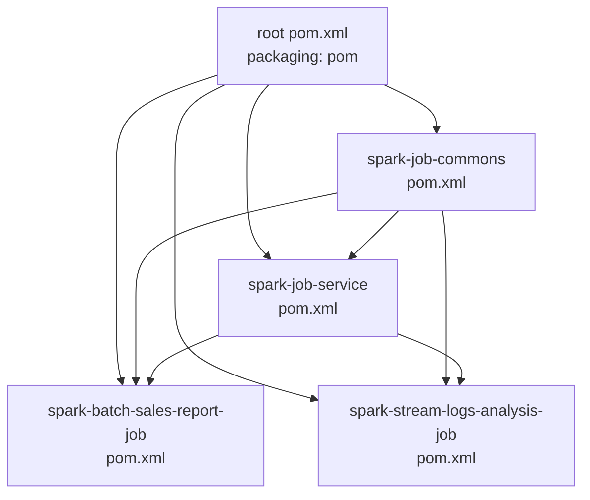
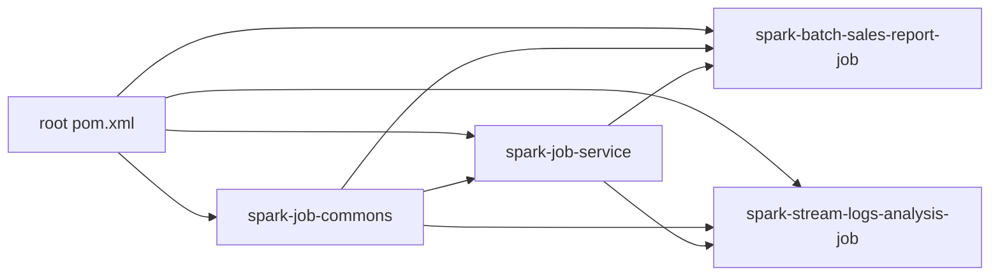
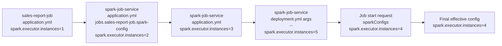
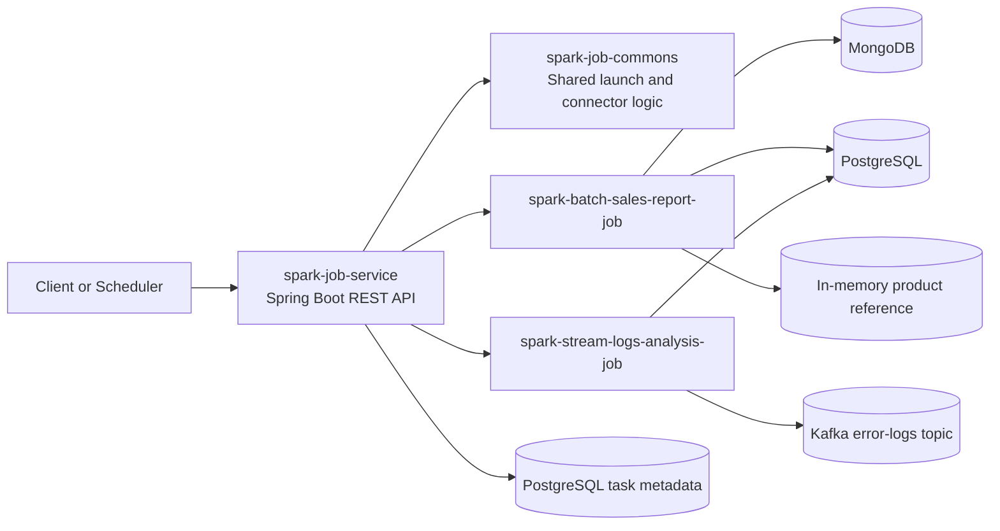
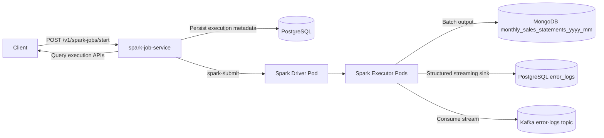
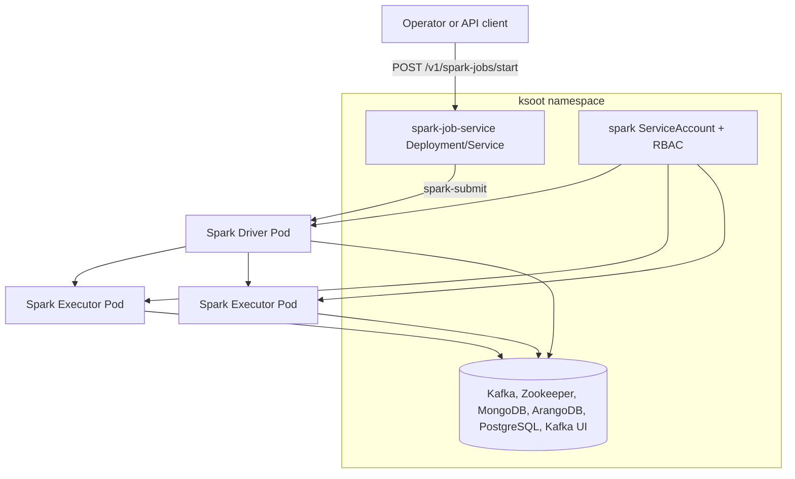
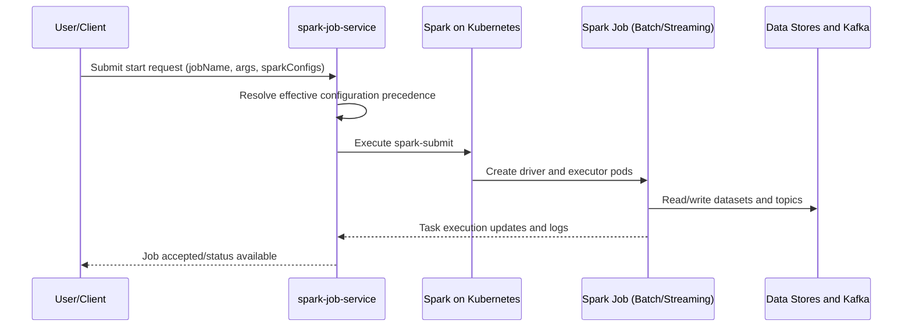
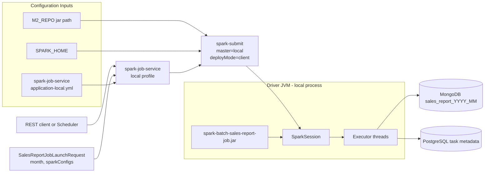
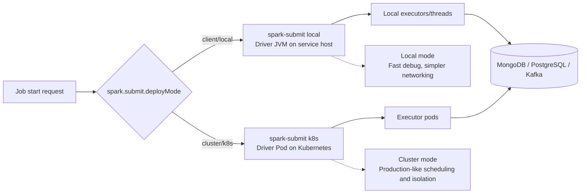

# Spark on Kubernetes End-to-End with Spring Boot

End-to-end reference project for launching and managing Apache Spark jobs from Spring Boot, with local development and Kubernetes deployment support.

This repository includes:
- A Spark job launcher service (`spark-job-service`) with REST APIs to start, stop, and track jobs.
- Two sample Spark jobs:
  - Batch: `spark-batch-sales-report-job`
  - Streaming: `spark-stream-logs-analysis-job`
- Shared Spark/job utilities in `spark-job-commons`.
- Infrastructure definitions for Docker Compose, Kubernetes manifests, and Helm.

## Project Modules

- [`spark-job-service`](spark-job-service/README.md): REST API service that builds and runs `spark-submit` commands.
- [`spark-job-commons`](spark-job-commons/README.md): Shared components used by Spark jobs.
- [`spark-batch-sales-report-job`](spark-batch-sales-report-job/README.md): Sample batch pipeline.
- [`spark-stream-logs-analysis-job`](spark-stream-logs-analysis-job/README.md): Sample streaming pipeline.

### Maven Components Organization (Mermaid)



### Maven Components Organization (Left-to-Right)



## Installation

### Prerequisites

- Java 21
- Maven 3.9+
- Docker and Docker Compose
- Optional for Kubernetes workflows:
  - `kubectl`
  - Minikube
  - Helm 3

This repository standardizes on system Maven (`mvn`) for builds and packaging.

### Build all modules

From repository root:

```bash
mvn clean install
```

## Local Development

### Makefile Happy Path

Use the root `Makefile` to run the most common local Kubernetes flow:

```bash
make mk-start
make mk-build mk-images
make mk-namespace mk-secrets
make mk-deploy mk-rollout-status
make mk-smoke
```

Default local passwords are defined in [k8s/platform-secrets-dev.yaml](k8s/platform-secrets-dev.yaml). Update that file before running in shared environments.

To see all available operational targets:

```bash
make help
```

### Makefile Usage Reference

Common operations from repository root:

```bash
# Build all project artifacts and images
make mk-build mk-images

# Deploy and verify
make mk-namespace mk-secrets
make mk-deploy mk-rollout-status
make mk-pods mk-services

# Submit smoke jobs (in-cluster)
make mk-smoke

# Host access via port-forward (each in its own terminal)
make mk-port-forward
make mk-port-forward-postgres
make mk-port-forward-kafka-ui
make mk-port-forward-spark-ui

# Cleanup
make mk-cleanup
make mk-cleanup-all
```

If host port-forward is unstable on your machine, prefer the in-cluster smoke commands (`make mk-smoke`) for job submission and validation.

### Docker Compose

Start local infrastructure:

```bash
set -a
source .env
set +a
docker compose -f docker/docker-compose.yml up -d
docker compose -f docker/docker-compose.yml ps
```

Default local values are provided in [.env](.env). Update this file before running in shared environments.

Main local endpoints from [`docker/docker-compose.yml`](docker/docker-compose.yml):
- Conduktor UI: http://localhost:8081
- Kafka UI: http://localhost:8100
- Kafka broker (host): `localhost:9092`
- PostgreSQL: `localhost:5432`
- MongoDB: `localhost:27017`
- ArangoDB: `localhost:8529`

Notes:
- If required by your workflow, create databases `spark_jobs_db` and `error_logs_db` and Kafka topics `job-stop-requests` and `error-logs`.
- Ensure required ports are available before running Compose.

### Run Services and Jobs

- Run the job launcher service from [`spark-job-service`](spark-job-service/README.md#running-locally).
- Run sample jobs directly from IDE or module-specific instructions:
  - [`spark-batch-sales-report-job`](spark-batch-sales-report-job/README.md)
  - [`spark-stream-logs-analysis-job`](spark-stream-logs-analysis-job/README.md)

`spark-job-service` default port is `8090` (see `spark-job-service/src/main/resources/config/application.yml`).

## Minikube

### Preparing for Minikube

Deploy infrastructure and RBAC:

```bash
kubectl apply -n ksoot -f k8s/platform-secrets-dev.yaml
kubectl apply -f k8s/infra-kubernetes-deploy.yml
kubectl apply -f k8s/spark-rbac.yml
kubectl config set-context --current --namespace=ksoot
kubectl get pods -n ksoot
```

For local access to `LoadBalancer` services on Minikube, run:

```bash
minikube tunnel
```

### Running on Minikube

- Build images for the modules you want to run.
- Load images into Minikube if needed.
- Deploy `spark-job-service` using [`k8s/deployment.yml`](k8s/deployment.yml) and use its REST APIs.

Detailed steps remain in module READMEs:
- [`spark-job-service`](spark-job-service/README.md)
- [`spark-batch-sales-report-job`](spark-batch-sales-report-job/README.md)
- [`spark-stream-logs-analysis-job`](spark-stream-logs-analysis-job/README.md)

## Kubernetes Configuration Files

- [`k8s/infra-kubernetes-deploy.yml`](k8s/infra-kubernetes-deploy.yml): Namespace (`ksoot`) and infra workloads/services (MongoDB, ArangoDB, PostgreSQL, Zookeeper, Kafka, Kafka UI).
- [`k8s/spark-rbac.yml`](k8s/spark-rbac.yml): Service account and RBAC bindings required by Spark driver/executor pods.
- [`k8s/deployment.yml`](k8s/deployment.yml): Deployment for the Spring Boot job launcher service.

## Helm

Helm chart is under [`helm`](helm). Example install:

```bash
helm install my-release ./helm -f helm/values-dev.yaml \
  --set platformSecrets.existingSecret=platform-secrets
```

### Helm E2E Quick Path

```bash
kubectl create namespace ksoot --dry-run=client -o yaml | kubectl apply -f -
kubectl apply -n ksoot -f k8s/platform-secrets-dev.yaml
helm upgrade --install local-release ./helm -n ksoot -f helm/values-dev.yaml \
  --set platformSecrets.existingSecret=platform-secrets
kubectl get pods -n ksoot -o wide
```

Detailed end-to-end Helm operations (verify, access, smoke checks, upgrade, uninstall):
[`RUNBOOK.md` section 10](RUNBOOK.md#10-helm-alternative-optional).

Environment-specific values files:
- [`helm/values-dev.yaml`](helm/values-dev.yaml)
- [`helm/values-qa.yaml`](helm/values-qa.yaml)
- [`helm/values-stg.yaml`](helm/values-stg.yaml)
- [`helm/values-prd.yaml`](helm/values-prd.yaml)

## GitHub Actions CI/CD

Workflow: [`.github/workflows/ci-cd.yml`](.github/workflows/ci-cd.yml)

Current behavior in workflow:
- Triggers on pushes to `dev`, `testing`, and `stg`.
- Triggers on pull requests targeting `prd`.
- Runs Maven build/tests per environment.
- Contains placeholders/comments for multi-image build/push and deployment expansion.

Required GitHub Environment Secrets (for `qa`, `stg`, and `prd` deployments):
- `PLATFORM_POSTGRES_PASSWORD`
- `PLATFORM_ARANGO_ROOT_PASSWORD`
- `PLATFORM_CDK_ADMIN_PASSWORD`
- `PLATFORM_CONDUKTOR_ANALYST_PASSWORD`
- `KUBECONFIG_QA`
- `KUBECONFIG_STG`
- `KUBECONFIG_PRD`
- `DOCKER_USERNAME`
- `DOCKER_PASSWORD`
- `DOCKER_REPO`

Preflight check (requires GitHub CLI `gh` authenticated to this repository):

```bash
required=(
  PLATFORM_POSTGRES_PASSWORD
  PLATFORM_ARANGO_ROOT_PASSWORD
  PLATFORM_CDK_ADMIN_PASSWORD
  PLATFORM_CONDUKTOR_ANALYST_PASSWORD
  KUBECONFIG_QA
  KUBECONFIG_STG
  KUBECONFIG_PRD
  DOCKER_USERNAME
  DOCKER_PASSWORD
  DOCKER_REPO
)

for env in qa stg prd; do
  echo "Checking environment: $env"
  existing=$(gh secret list --env "$env" --json name --jq '.[].name')
  for key in "${required[@]}"; do
    if ! echo "$existing" | grep -qx "$key"; then
      echo "  MISSING: $key"
    fi
  done
done
```

## Configuration Precedence Order

At the project level, configuration precedence follows standard Spring Boot external configuration rules:
- https://docs.spring.io/spring-boot/reference/features/external-config.html

For job launching specifically:
1. Request-level `sparkConfigs` passed to `spark-job-service` APIs (highest precedence)
2. `spark-job-service` deployment/runtime overrides
3. `spark-job-service` application configuration
4. Individual job module defaults (lowest precedence)

### Configuration Precedence Diagram (Mermaid)



## Architecture and Diagrams

### Components Diagram (Mermaid)



### Dataflow Diagram (Mermaid)



### Deployment Diagram (Mermaid)



### End-to-End Architecture Flow (Mermaid)



### Local Deploy View (Mermaid)



### Deploy Modes View (Mermaid)




## References

- Apache Spark: https://spark.apache.org/docs/4.0.0
- Running Spark on Kubernetes: https://spark.apache.org/docs/4.0.0/running-on-kubernetes.html
- Spark Submit: https://spark.apache.org/docs/4.0.0/submitting-applications.html
- Spark Configuration: https://spark.apache.org/docs/4.0.0/configuration.html
- Spark Structured Streaming + Kafka: https://spark.apache.org/docs/4.0.0/structured-streaming-kafka-integration.html
- Spring Boot docs: https://docs.spring.io/spring-boot/index.html
- Spring Externalized Configuration: https://docs.spring.io/spring-boot/reference/features/external-config.html