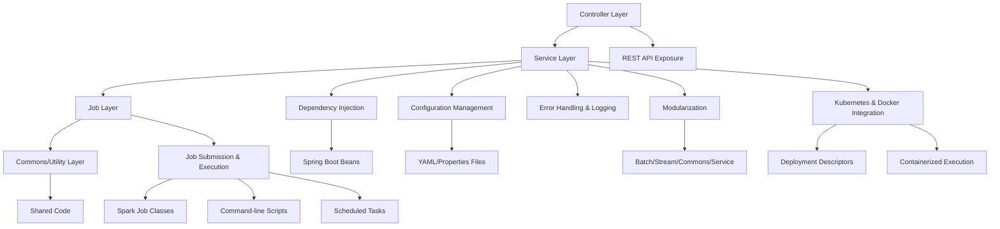
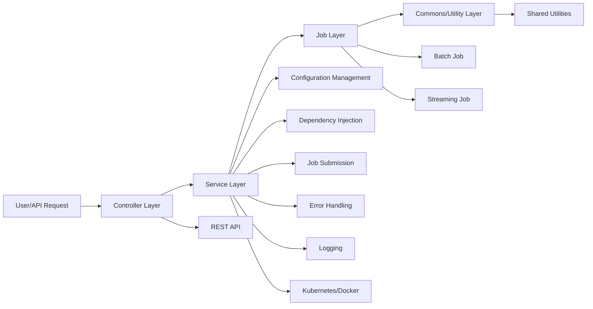
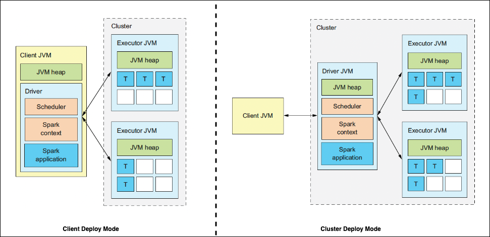
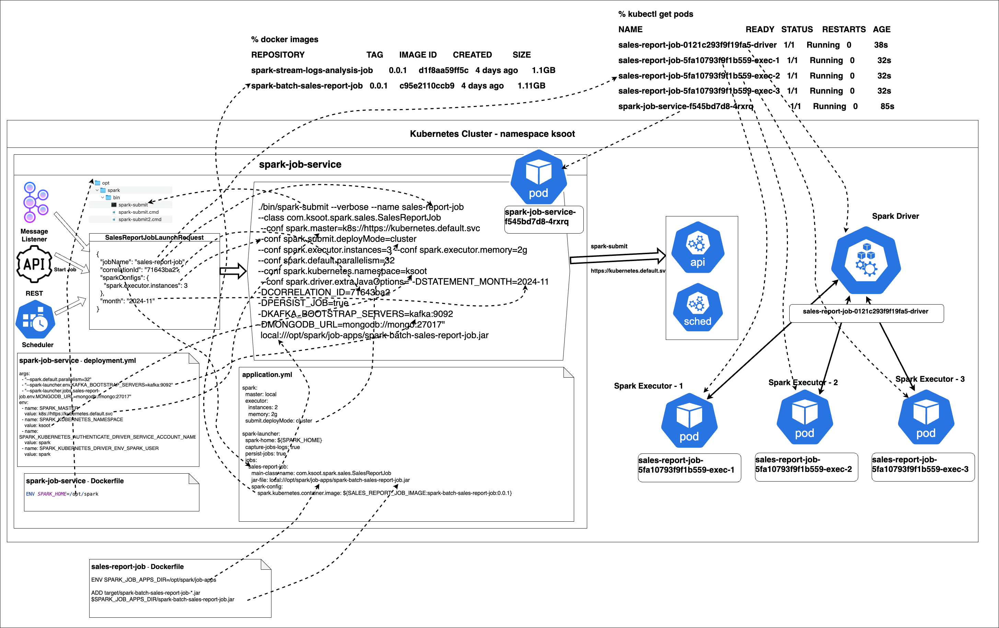
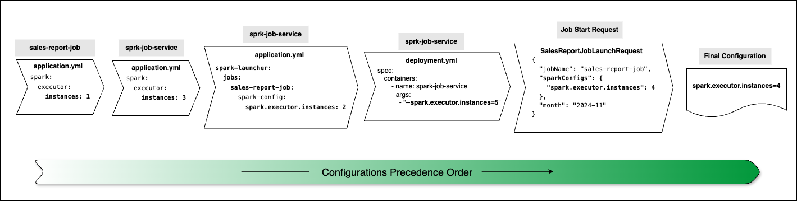
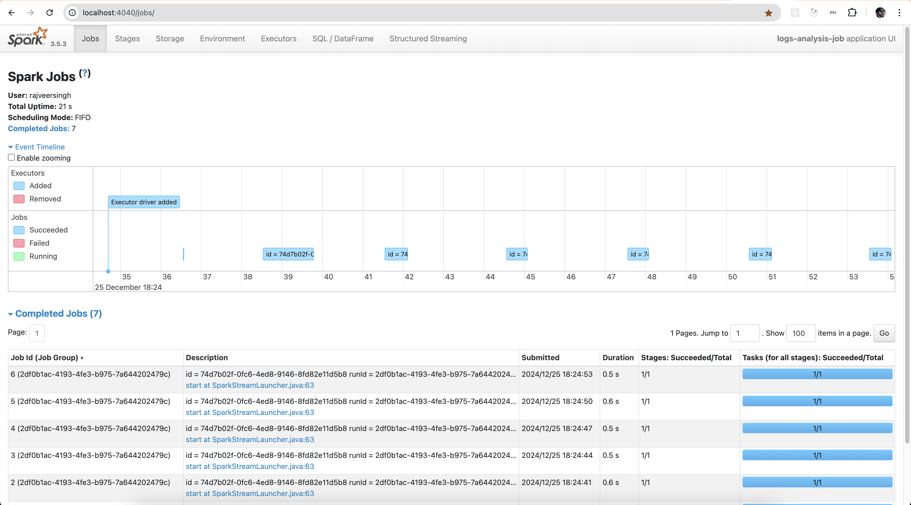

# <span style="color:#7b1fa2;font-weight:bold;">Kubernetes‑Native Spark Architecture with Spring Boot and Helm</span>

This repository delivers an advanced big data engineering platform for running Spark jobs with Spring Boot, built on leading-edge architecture and modern design patterns. It supports both local development and production-grade Kubernetes deployments, enabling scalable, resilient, and maintainable data solutions for enterprise environments.

This is a end-to-end and advanced reference project for building Kubernetes‑Native Spark Architecture with Spring Boot and Helm.

> **Production Ready:**
> - This is a production-ready Spark streaming project with robust architecture and best practices for reliability and scalability.
> - End-to-end CI/CD pipelines are included for automated build, test, deployment, and environment management.
> - Complete lifecycle management: job launching, monitoring, termination, and error handling are integrated.
> - Modular design enables easy extension for batch and streaming jobs, with reusable commons and service APIs.
> - Secure credential and configuration management for all environments (dev, QA, staging, production).
> - Supports local development, Minikube, and full Kubernetes clusters.
> - Infrastructure templates for Kafka, Zookeeper, PostgreSQL, MongoDB, ArangoDB, and more.
> - See below for details on CI/CD, deployment, and architecture.

It integrates CI/CD pipelines, container orchestration, and multi-environment configuration for seamless development, testing, and operations. The project includes modular Spark job applications, a job service API, and infrastructure templates for Kafka, Zookeeper, PostgreSQL, and more. Developers can quickly build, test, and deploy Spark jobs, leveraging automated workflows and secure environment management.


## <span style="color:#388e3c;font-weight:bold;">Project Directory Structure</span>

```
.github/workflows/*
helm/
  Chart.yaml
  templates/
    conduktor-configmap.yaml
    conduktor-deployment.yaml
    kafka-deployment.yaml
    postgres-deployment.yaml
    zookeeper-deployment.yaml
  values-dev.yaml
  values-prd.yaml
  values-qa.yaml
  values-stg.yaml
  values.yaml
img/*
spark-batch-sales-report-job/
  .gitignore
  Dockerfile
  README.md
  mvnw
  mvnw.cmd
  pom.xml
  src/*
spark-job-commons/
  .gitignore
  README.md
  mvnw
  mvnw.cmd
  pom.xml
  src/*
spark-job-service/
  .gitignore
  Dockerfile
  README.md
  api-spec/
  cmd/
  deployment.yml
  mvnw
  mvnw.cmd
  pom.xml
  src/*
spark-stream-logs-analysis-job/
  .gitignore
  Dockerfile
  README.md
  mvnw
  mvnw.cmd
  pom.xml
  src/*
.gitignore
conduktor-config.yml
default-platform-config.yaml
docker-compose.yml
Dockerfile
infra-kubernetes-deploy.yml
LICENSE
mvnw
mvnw.cmd
pom.xml
README.md
spark-rbac.yml
```


# <span style="color:#1976d2;font-weight:bold;">1. GitHub Actions CI/CD Integration</span>

This project uses GitHub Actions for automated CI/CD across multiple environments (dev, QA, staging, production). The workflow is defined in [.github/workflows/ci-cd.yml](.github/workflows/ci-cd.yml) and provides:

- **Automatic build and test** for every push to the `dev`, `testing`, and `stg` branches.
- **Docker image build and push** for each environment using secure repository secrets.
- **Kubernetes deployment** using environment-specific credentials and Helm or kubectl.
- **Production deployment** triggered by pull requests to the `prd` branch.

### Environment Credentials
- All sensitive credentials (Docker, Kubernetes, etc.) are stored as GitHub repository secrets and mapped to each environment.
- The pipeline decodes and configures kubeconfig for each environment before deployment.

### How it works
1. On code push or PR, the pipeline runs build, test, and (if applicable) Docker and deployment steps.
2. Each environment (dev, qa, stg, prd) uses its own secrets for Docker and Kubernetes access.
3. Deployments are automated and isolated per environment.

See the workflow file for details and adjust as needed for your infrastructure.

# <span style="color:#388e3c;font-weight:bold;">2. Local Development & Kubernetes Deployment: Step-by-Step Guide</span>

## <span style="color:#388e3c;font-weight:bold;">2.1. Local Development Setup (Detailed)</span>
1. **Clone the repository:**
   ```sh
   git clone <repo-url>
   cd Spring-Boot-Spark-Kubernetes
   ```
2. **Start all services locally:**
   - Launch all required services (Kafka, Zookeeper, PostgreSQL, MongoDB, ArangoDB, Conduktor, Spark jobs) with:
     ```sh
     docker compose up -d
     ```
   - Check service status:
     ```sh
     docker compose ps
     ```
3. **Build and run Spark job modules locally:**
   - Each Spark job is a Spring Boot application. You can run them directly from your IDE or with Maven:
     ```sh
     cd spark-batch-sales-report-job
     ./mvnw spring-boot:run
     # or build a JAR
     ./mvnw clean package
     java -jar target/*.jar
     ```
   - Repeat for other modules as needed.
4. **Access UIs and APIs:**
   - **Conduktor UI:** [http://localhost:8081](http://localhost:8081)
   - **Kafka UI:** [http://localhost:8100](http://localhost:8100)
   - **Spark Job Service API:** [http://localhost:<service-port>]
   - Default admin credentials are set in `docker-compose.yml` (see `CDK_ADMIN_EMAIL`, `CDK_ADMIN_PASSWORD`).
5. **Develop and debug:**
   - Use breakpoints, hot reload, and Spring Boot DevTools for rapid development.
   - Use the REST API in `spark-job-service` to submit jobs and monitor status.
6. **Database and persistence:**
   - PostgreSQL is used for job metadata and Conduktor persistence.
   - MongoDB and ArangoDB are available for job-specific data needs.

## <span style="color:#388e3c;font-weight:bold;">2.2. Deployment to Kubernetes (Detailed)</span>
### <span style="color:#388e3c;font-weight:bold;">2.2.1. Standard kubectl Deployment</span>
1. **Build Docker images:**
   - Each module has a `Dockerfile`. Build images for all Spark jobs and services:
     ```sh
     cd spark-batch-sales-report-job
     docker build -t myrepo/spark-batch-sales-report-job:latest .
     # Repeat for other modules
     ```
2. **Push images to a registry:**
   - Tag and push images to your container registry (Docker Hub, ECR, GCR, etc.):
     ```sh
     docker tag myrepo/spark-batch-sales-report-job:latest <your-registry>/spark-batch-sales-report-job:latest
     docker push <your-registry>/spark-batch-sales-report-job:latest
     # Repeat for other modules
     ```
3. **Configure Kubernetes manifests:**
   - Use `infra-kubernetes-deploy.yml` as a template.
   - Update image references, environment variables, and persistent volume claims as needed.
   - Example snippet:
     ```yaml
     apiVersion: apps/v1
     kind: Deployment
     metadata:
       name: spark-batch-sales-report-job
     spec:
       template:
         spec:
           containers:
           - name: spark-batch-sales-report-job
             image: <your-registry>/spark-batch-sales-report-job:latest
             env:
             - name: SPRING_PROFILES_ACTIVE
               value: kubernetes
     ```
4. **Deploy to Kubernetes:**
   - Apply manifests:
     ```sh
     kubectl apply -f infra-kubernetes-deploy.yml
     ```
   - Check pod and service status:
     ```sh
     kubectl get pods
     kubectl get svc
     ```
5. **Access UIs and APIs in Kubernetes:**
   - Expose services via NodePort, LoadBalancer, or Ingress as needed.
   - Example (NodePort):
     ```yaml
     kind: Service
     apiVersion: v1
     metadata:
       name: conduktor
     spec:
       type: NodePort
       ports:
         - port: 8080
           targetPort: 8080
           nodePort: 30081
     ```
   - Access Conduktor at `http://<node-ip>:30081`.
6. **Monitor and manage:**
   - Use `kubectl logs <pod>`, `kubectl describe <pod>`, and your Kubernetes dashboard for troubleshooting.
   - Scale deployments and manage resources as needed.

### <span style="color:#388e3c;font-weight:bold;">2.2.2. Helm Chart Deployment</span>
1. **Configure environment-specific values:**
   - Edit or review the provided values files in `helm/` (e.g., `values-dev.yaml`, `values-qa.yaml`, `values-stg.yaml`, `values-prd.yaml`).
2. **Package or use the Helm chart directly:**
   - From the project root:
     ```sh
     helm dependency update ./helm
     # (optional) helm package ./helm
     ```
3. **Install or upgrade the release for your environment:**
   - For DEV:
     ```sh
     helm install my-release ./helm -f helm/values-dev.yaml
     # or upgrade
     helm upgrade my-release ./helm -f helm/values-dev.yaml
     ```
   - For QA, STG, PRD: use the corresponding values file.
4. **Check deployment status:**
   ```sh
   helm list
   kubectl get pods
   kubectl get svc
   ```
5. **Rollback or uninstall if needed:**
   ```sh
   helm rollback my-release <revision>
   helm uninstall my-release
   ```
6. **Customize further:**
   - Add or override values with `--set key=value` or additional `-f` files as needed.

> [!IMPORTANT]  
> It is recommended to have port numbers same as mentioned above, otherwise you may need to change at multiple places i.e. in job's `application-local.yml`, `spark-job-service` application ymls and deployment yml etc.

> [!IMPORTANT]  
> While using docker compose make sure the required ports are free on your machine, otherwise port busy error could be thrown.

#### <span style="color:#388e3c;font-weight:bold;">2.3. Manual</span>
All these services can be installed locally on your machine, and should be accessible at above-mentioned urls and credentials (wherever applicable).

#### <span style="color:#388e3c;font-weight:bold;">2.4. Docker compose</span>
* The [docker-compose.yml](docker-compose.yml) file defines the services and configurations to run required infrastructure in Docker. 
* In Terminal go to project root `spring-boot-spark-kubernetes` and execute following command and confirm if all services are running.
```shell
docker compose up -d
```
* Create databases `spark_jobs_db` and `error_logs_db` in Postgres and Kafka topics `job-stop-requests` and `error-logs` if they do not exist.

> [!IMPORTANT]  
> While using docker compose make sure the required ports are free on your machine, otherwise port busy error could be thrown.

#### <span style="color:#388e3c;font-weight:bold;">2.5. Minikube</span>
* In Terminal go to project root `spring-boot-spark-kubernetes` and execute following commands to create a namespace `ksoot` and necessary Kubernetes services in given namespace. 
Refer to [Kubernetes configuration files section](#kubernetes-configuration-files) for more details.
```shell
kubectl apply -f infra-kubernetes-deploy.yml
kubectl apply -f spark-rbac.yml
```
* Set default namespace to `ksoot` in minikube. You can always rollback to default namespace.
```shell
kubectl config set-context --current --namespace=ksoot
```
* Check if all infra pods are running.
```shell
kubectl get pods
```
Output should look like below.
```shell
NAME                         READY   STATUS    RESTARTS   AGE
arango-65d6fff6c5-4bjwq      1/1     Running   0          6m16s
kafka-74c8d9579f-jmcr5       1/1     Running   0          6m16s
kafka-ui-797446869-9d8zw     1/1     Running   0          6m16s
mongo-6785c5cf8b-mtbk7       1/1     Running   0          6m16s
postgres-685b766f66-7dnsl    1/1     Running   0          6m16s
zookeeper-6fc87d48df-2t5pf   1/1     Running   0          6m16s
```
* Establish minikube tunnel to expose services of type `LoadBalancer` running in Minikube cluster to local machine. 
It creates a bridge between your local network and the Minikube cluster, making the required infrastructure accessible to local.
```shell
minikube tunnel
```
Keep it running in a separate terminal. Output should look like below.
```shell
✅  Tunnel successfully started

📌  NOTE: Please do not close this terminal as this process must stay alive for the tunnel to be accessible ...

🏃  Starting tunnel for service arango.
🏃  Starting tunnel for service kafka.
🏃  Starting tunnel for service kafka-ui.
🏃  Starting tunnel for service mongo.
🏃  Starting tunnel for service postgres.
🏃  Starting tunnel for service zookeeper.
```
* No need to create any databases or kafka topics required by applications as they are automatically created by [infra-kubernetes-deploy.yml](infra-kubernetes-deploy.yml).


# <span style="color:#7b1fa2;font-weight:bold;">3. Framework Architecture</span>
# <span style="color:#1976d2;font-weight:bold;">Spring Boot Spark Application Design Pattern</span>

This application follows a layered architecture, combining Spring Boot’s dependency injection and configuration management with Apache Spark’s distributed data processing.

## Design Pattern Overview

- **Layered Structure:**
  - Controller Layer: Handles HTTP requests (REST API), delegates to service layer.
  - Service Layer: Contains business logic, orchestrates Spark jobs, manages workflow.
  - Job Layer: Defines Spark jobs (batch or streaming), encapsulates Spark transformations and actions.
  - Commons/Utility Layer: Shared code, helpers, and reusable components.
- **Configuration Management:** Uses Spring Boot’s YAML/properties files for environment-specific settings. Spark job parameters, cluster configs, and resource allocation are managed via Spring’s configuration.
- **Dependency Injection:** Spring Boot injects beans for services, repositories, and Spark job classes, promoting loose coupling and testability.
- **Job Submission & Execution:** Jobs are triggered via REST endpoints, scheduled tasks, or command-line scripts. Spark jobs are defined as classes, often extending a base job class or implementing a job interface.
- **Error Handling & Logging:** Uses Spring Boot’s exception handling and logging for unified error management.
- **Modularization:** Multiple modules (batch, stream, commons, service) allow separation of concerns and easier maintenance.
- **Kubernetes & Docker Integration:** Deployment descriptors enable containerized and orchestrated execution.


## Architecture Diagrams

### Layered Design Pattern (Mermaid)



### Layered Flow (Mermaid)



---
The diagrams above illustrate the flow from user/API request through controller, service, job, and utility layers, and show integration points for configuration, dependency injection, job submission, error handling, logging, modularization, and Kubernetes/Docker deployment.


## <span style="color:#7b1fa2;font-weight:bold;">3.1. Features</span>
- **Job Launching**: Trigger Spark jobs via REST endpoint for deployment on local and kubernetes. Either **Job jars** or **Docker images** can be launched using spark-submit
- **Job Termination**: Accept requests to stop running jobs via REST endpoint, though not a gauranteed method. You may need to kill the job manually if not terminated by this.
- **Job Monitoring**: Track job status, start and end time, duration taken, error messages if there is any, via REST endpoints.
- **Auto-configurations**: of Common components such as `SparkSession`, Job lifecycle listener and Connectors to read and write to various datasources.
- **Demo Jobs**: A [Spark Batch Job](spark-batch-sales-report-job) and another [Spark Streaming Job](spark-stream-logs-analysis-job), to start with.

## <span style="color:#7b1fa2;font-weight:bold;">3.2. Components</span>
The framework consists of following components. Refer to respective project's README for details.
- [**spark-job-service**](spark-job-service/README.md): A Spring Boot application to launch Spark jobs and monitor their status.
- [**spring-boot-starter-spark**](https://github.com/officiallysingh/spring-boot-starter-spark): Spring boot starter for Spark.
- [**spark-job-commons**](spark-job-commons/README.md): A library to provide common Job components and utilities for Spark jobs.
- [**spark-batch-sales-report-job**](spark-batch-sales-report-job/README.md): A demo Spark Batch Job to generate Monthly sales reports.
- [**spark-stream-logs-analysis-job**](spark-stream-logs-analysis-job/README.md): A demo Spark Streaming Job to analyze logs in real-time.

## <span style="color:#7b1fa2;font-weight:bold;">3.3. Kubernetes configuration files</span>
The framework includes Kubernetes configuration files to deploy the required infrastructure and services in a Kubernetes cluster in namespace **`ksoot`**. You can change the namespace in these two files as per your requirement.
Each service is configured with necessary environment variables, volume mounts, and ports to ensure proper operation within the Kubernetes cluster.
1. The [infra-kubernetes-deploy.yml](infra-kubernetes-deploy.yml) file defines the Kubernetes resources required to deploy various services.
- **Namespace**: Creates a namespace **`ksoot`**.
- **MongoDB**: Deployment, PersistentVolumeClaim, and Service for MongoDB.
- **ArangoDB**: Deployment, PersistentVolumeClaim, and Service for ArangoDB.
- **PostgreSQL**: Deployment, PersistentVolumeClaim, ConfigMap (for initialization script), and Service for PostgreSQL.
- **Zookeeper**: Deployment, PersistentVolumeClaims (for data and logs), and Service for Zookeeper.
- **Kafka**: Deployment, PersistentVolumeClaim, and Service for Kafka.
- **Kafka UI**: Deployment and Service for Kafka UI.
2. The [spark-rbac.yml](spark-rbac.yml) file defines the Kubernetes `RBAC` (Role-Based Access Control) resources required to allow Spark to manage Driver and Executor pods within the **`ksoot`** namespace.
- **ClusterRoleBinding**: Binds the default `ServiceAccount` to the `cluster-admin` `ClusterRole`, allowing it to have cluster-wide administrative privileges.
- **ServiceAccount**: Creates a ServiceAccount named `spark`.
- **ClusterRoleBinding**: Binds the spark ServiceAccount to the `edit` `ClusterRole`, granting it permissions to edit resources within the namespace.

## <span style="color:#7b1fa2;font-weight:bold;">3.4. Running Jobs Locally</span>
- Individual Spark Jobs can be run as Spring boot application locally in your favorite IDE. Refer to [sales-report-job](spark-batch-sales-report-job/README.md#intellij-run-configurations) and [logs-analysis-job](spark-stream-logs-analysis-job/README.md#intellij-run-configurations).
- Spark Job can be Launched locally via REST API provided by `spark-job-service`. Refer to [spark-job-service](spark-job-service/README.md#running-locally) for details.  
> [!IMPORTANT]  
> Spark Job's `jar` files from Maven repository are deployed on local via `spark-submit` command.

## <span style="color:#7b1fa2;font-weight:bold;">3.5. Running Jobs on Minikube</span>
### <span style="color:#7b1fa2;font-weight:bold;">3.5.1. Preparing for Minikube</span>
* Make sure minikube infra is ready as mentioned in [Minikube Environment setup section](#minikube).
* Build custom base Docker image for Spark for more control over it, Refer to base [Dockerfile](Dockerfile) for details. Spark contains a lot of jars at `${SPARK_HOME/jars}`, some of which may conflict with your application jars. So you may need to exclude such jars from Spark.  
  For example following conflicting jars are excluded from Spark in base [Dockerfile](Dockerfile).
```shell
# Remove any spark jars that may be conflict with the ones in your application dependencies.
rm -f jars/protobuf-java-2.5.0.jar; \
rm -f jars/guava-14.0.1.jar; \
rm -f jars/HikariCP-2.5.1.jar; \
```
* In Terminal go to root project `spring-boot-spark-kubernetes` and execute the following command to build Spark base Docker image. All Job's Dockerfiles extend from this image.
```shell
docker image build . -t ksoot/spark:4.0.0 -f Dockerfile
```
* In Terminal go to project `spring-boot-spark-kubernetes/spark-batch-sales-report-job` and execute following command to build docker image for `sales-report-job`.
```shell
docker image build . -t spark-batch-sales-report-job:0.0.1 -f Dockerfile
```
* In Terminal go to project `spring-boot-spark-kubernetes/spark-stream-logs-analysis-job` and execute following command to build docker image for `logs-analysis-job`.
```shell
docker image build . -t spark-stream-logs-analysis-job:0.0.1 -f Dockerfile
```
* Load Job images in minikube.
```shell
minikube image load spark-batch-sales-report-job:0.0.1
minikube image load spark-stream-logs-analysis-job:0.0.1
```
* In Terminal go to project `spring-boot-spark-kubernetes/spark-job-service` and execute following command to build docker image for `spark-job-service`.
```shell
docker image build . -t spark-job-service:0.0.1 -f Dockerfile
```
* Load Job `spark-job-service` image in minikube.
```shell
minikube image load spark-job-service:0.0.1
```

### <span style="color:#7b1fa2;font-weight:bold;">3.5.2. Running on Minikube</span>
* Make sure [Environment setup on Minikube](#minikube) is already done and [application artifacts are ready](#preparing-for-minikube).
> [!IMPORTANT]  
> No configuration change is required except specifically asked to run this code locally.
* You can override any configurations **that are defined in** [spark-job-service application.yml](spark-job-service/src/main/resources/config/application.yml) and Spark Jobs using environment variables in [spark-job-service deployment.yml](spark-job-service/deployment.yml) as follows.
```yaml
env:
  # Spark properties
  - name: SPARK_MASTER
    value: k8s://https://kubernetes.default.svc
  - name: SPARK_KUBERNETES_NAMESPACE
    value: ksoot
  - name: SPARK_KUBERNETES_AUTHENTICATE_DRIVER_SERVICE_ACCOUNT_NAME
    value: spark
  - name: SPARK_KUBERNETES_DRIVER_ENV_SPARK_USER
    value: spark
  - name: SPARK_SUBMIT_DEPLOY_MODE
    value: cluster
  # Application properties
  - name: KAFKA_BOOTSTRAP_SERVERS
    value: kafka:9092
  - name: POSTGRES_URL
    value: jdbc:postgresql://postgres:5432/spark_jobs_db
  - name: JDBC_URL
    value: jdbc:postgresql://postgres:5432
  - name: PERSIST_JOBS
    value: "true"
  - name: CAPTURE_JOBS_LOGS
    value: "true"
```
* You can override any configurations **that are not defined in** [spark-job-service application.yml](spark-job-service/src/main/resources/config/application.yml) as follows.
```yaml
args:
  - "--spark.executor.instances=2"
  - "--spark.default.parallelism=16"
  - "--spark-launcher.env.POSTGRES_URL=jdbc:postgresql://postgres:5432/spark_jobs_db"
  - "--spark-launcher.env.KAFKA_BOOTSTRAP_SERVERS=kafka:9092"
  - "--spark-launcher.jobs.sales-report-job.env.MONGODB_URL=mongodb://mongo:27017"
  - "--spark-launcher.jobs.sales-report-job.env.ARANGODB_URL=arango:8529"
  - "--spark-launcher.jobs.logs-analysis-job.env.JDBC_URL=jdbc:postgresql://postgres:5432"
```
> [!IMPORTANT]  
> In Production, it is recommended to use Kubernetes Secrets for sensitive information like passwords, tokens, and keys etc.

* Execute following command to deploy `spark-job-service` on minikube.
```shell
kubectl apply -f deployment.yml
```
* Verify that `spark-job-service` pod is running
```shell
kubectl get pods
```
  Output should look like below.
```shell
NAME                                READY   STATUS              RESTARTS   AGE
spark-job-service-f545bd7d8-s4sn5   1/1     Running             0          9s
```
* Port forward  `spark-job-service` server port in a separate terminal, to access it from local. **Replace following POD name with your POD name**.
```shell
kubectl port-forward spark-job-service-f545bd7d8-s4sn5 8090:8090
```
  Output should look like below.
```shell
Forwarding from 127.0.0.1:8090 -> 8090
Forwarding from [::1]:8090 -> 8090
```
* Now Minikube is ready for Spark Jobs deployment, make API calls from [Swagger](http://localhost:8090/swagger-ui/index.html?urls.primaryName=Spark+Jobs) or Postman to start and explore jobs.
* If `spark-submit` command is executed successfully while Launching a Job, then you should be able to see the Spark Driver and Executor pods running for respective Job in minikube.
```shell
kubectl get pods
```
  Output should look like below.
```shell
NAME                                             READY   STATUS    RESTARTS   AGE
sales-report-job-2e9c6f93ef784c17-driver         1/1     Running   0          11s
sales-report-job-9ac2e493ef78625a-exec-1         1/1     Running   0          6s
sales-report-job-9ac2e493ef78625a-exec-2         1/1     Running   0          6s
```
* Once the Job is complete, executor pods are terminated automatically. Though driver pod remains in `Completed` state, but it does not consume any resources.
```shell
NAME                                             READY   STATUS      RESTARTS   AGE
sales-report-job-2e9c6f93ef784c17-driver         0/1     Completed   0          2m56s
```
* If the Job fails, Executor pods are still terminated, but driver pod remains in `Error` state. For debugging, you can see pod logs.
* Eventually you may want to clean up by deleting the pods or `minikube delete`.
> [!IMPORTANT]  
> All applications run in `default` profile on minikube.  
> Spark Job's Docker images are deployed on Kubernetes via `spark-submit` command.

## <span style="color:#7b1fa2;font-weight:bold;">3.6. Deployment architecture</span>
### <span style="color:#7b1fa2;font-weight:bold;">3.6.1. Deploy Modes</span>
There are two deployment modes for Spark Job deployment on Kubernetes.
- **Client Deploy Mode**: The driver runs in the client’s JVM process and communicates with the executors managed by the cluster.
- **Cluster Deploy Mode**: The driver process runs as a separate JVM process in a cluster, and the cluster manages its resources.



### <span style="color:#7b1fa2;font-weight:bold;">3.6.2. Deployment process</span>



### <span style="color:#7b1fa2;font-weight:bold;">3.6.3. Configurations precedence order</span>
Configurations can be provided at multiple levels. At individual project level, the precedence order is [Standard Spring Boot configurations precedence order](https://docs.spring.io/spring-boot/reference/features/external-config.html).
* In `application.yml`s of individual Jobs projects and profile specific `yml`s.
* In `application.yml`s of `spark-job-service`.
* As environment in `deployment.yml` of `spark-job-service`.
* As arguments in `deployment.yml` of `spark-job-service`.

**Configurations are resolved in the following order.**



### <span style="color:#7b1fa2;font-weight:bold;">3.6.4. Spark UI</span>
Access Spark UI at [**`http://localhost:4040`**](http://localhost:4040) to monitor and inspect Spark Batch job execution. 
On Minikube or Kubernetes you may need to do port forwarding to access it, and it may not be accessible if Job is not in running state at the moment.

> [!IMPORTANT]
> In case port 4040 is busy Spark UI would be started on another port, and this new port would be logged into application logs,
> so you can check logs to get the correct port.



# <span style="color:#d32f2f;font-weight:bold;">4. Common Errors</span>
* `24/12/26 01:07:11 INFO KerberosConfDriverFeatureStep: You have not specified a krb5.conf file locally or via a ConfigMap. Make sure that you have the krb5.conf locally on the driver image.
24/12/26 01:07:12 ERROR Client: Please check "kubectl auth can-i create pod" first. It should be yes.`  
**Possible cause**: Wrong `spark.master` value or `spark-rbac.yml` is not applied properly in correct namespace.     
**Solution**: Set correct `spark.master` value in `application.yml` and `deployment.yml` in `spark-job-service` or apply `spark-rbac.yml` properly.
* `Factory method 'sparkSession' threw exception with message: class org.apache.spark.storage.StorageUtils$ (in unnamed module @0x2049a9c1) cannot access class sun.nio.ch.DirectBuffer (in module java.base) because module java.base does not export sun.nio.ch to unnamed module @0x2049a9c1`.  
**Possible cause**: The error message indicates that your Spark application is trying to access an internal Java class (sun.nio.ch.DirectBuffer) in the java.base module, which is not exported to Spark’s unnamed module. This issue arises because Java modules introduced in JDK 9 restrict access to internal APIs.  
**Solution**: Add VM option `--add-exports java.base/sun.nio.ch=ALL-UNNAMED`

# <span style="color:#0288d1;font-weight:bold;">5. Testing</span>
All main modules include mock-based unit tests in their `src/test/java` folders. These tests validate core logic without loading the full Spring or Spark context, ensuring fast and reliable test execution. Advanced tests (integration, API, edge cases) can be added as needed.

# <span style="color:#fbc02d;font-weight:bold;">6. References</span>
- [Apache Spark](https://spark.apache.org/docs/4.0.0)
- [Bitnami Helm package for Apache Spark](https://github.com/bitnami/charts/tree/main/bitnami/spark/#bitnami-package-for-apache-spark)
- [Exception handling in Spring boot Web applications](https://github.com/officiallysingh/spring-boot-problem-handler).
- [Running Spark on Kubernetes](https://spark.apache.org/docs/4.0.0/running-on-kubernetes.html)
- [Spark ArangoDB Connector](https://docs.arangodb.com/3.13/develop/integrations/arangodb-datasource-for-apache-spark)
- [Spark Configurations](https://spark.apache.org/docs/4.0.0/configuration.html)
- [Spark in Action](https://www.manning.com/books/spark-in-action-second-edition)
- [Spark Kafka Connector](https://spark.apache.org/docs/4.0.0/structured-streaming-kafka-integration.html)
- [Spark Launcher](https://mallikarjuna_g.gitbooks.io/spark/content/spark-SparkLauncher.html)
- [Spark MongoDB Connector](https://www.mongodb.com/docs/spark-connector/v10.4)
- [Spark Performance Tuning](https://spark.apache.org/docs/3.5.3/sql-performance-tuning.html)
- [Spark Streaming](https://spark.apache.org/docs/4.0.0/streaming-programming-guide.html)
- [Spark Submit](https://spark.apache.org/docs/4.0.0/submitting-applications.html)
- [Spark UI](https://spark.apache.org/docs/4.0.0/web-ui.html)
- [Spring Boot Configurations](https://docs.spring.io/spring-boot/reference/features/external-config.html)
- [Spring boot starter for Spark](https://github.com/officiallysingh/spring-boot-starter-spark).
- [Spring Boot](https://docs.spring.io/spring-boot/index.html)
- [Spring Cloud Task](https://spring.io/projects/spring-cloud-task)
- Spark Performance Optimization [Part 1](https://blog.cloudera.com/how-to-tune-your-apache-spark-jobs-part-1) and [Part 2](https://blog.cloudera.com/how-to-tune-your-apache-spark-jobs-part-2)


# <span style="color:#455a64;font-weight:bold;">7. Tips & Best Practices</span>
- Use [Minikube](https://minikube.sigs.k8s.io/docs/) for local Kubernetes testing.
- Use [skaffold](https://skaffold.dev/) or similar tools for rapid build/deploy cycles.
- Store secrets and sensitive configs in Kubernetes Secrets, not in plain manifests.

# <span style="color:#d32f2f;font-weight:bold;">8. ⚠️ Notes & Caution</span>

> **Please read carefully before using this repository:**
> - Ensure you understand the CI/CD and deployment workflows before running in production; misconfiguration may lead to downtime or security risks.
> - Sensitive credentials and secrets must be managed securely (use GitHub Secrets, Kubernetes Secrets, never commit them to source).
> - Review and adapt infrastructure templates (Kubernetes, Docker, Helm) to your own environment and compliance requirements.
> - Test changes in a safe environment (local, Minikube, staging) before deploying to production.
> - Monitor resource usage and scaling; improper settings may cause performance issues or unexpected costs.
> - Always check compatibility of Spark, Spring Boot, and other dependencies with your target environment.
> - This project is intended for advanced users familiar with distributed systems, Kubernetes, and CI/CD pipelines.
> - For critical workloads, consult your DevOps and security teams before adoption.
