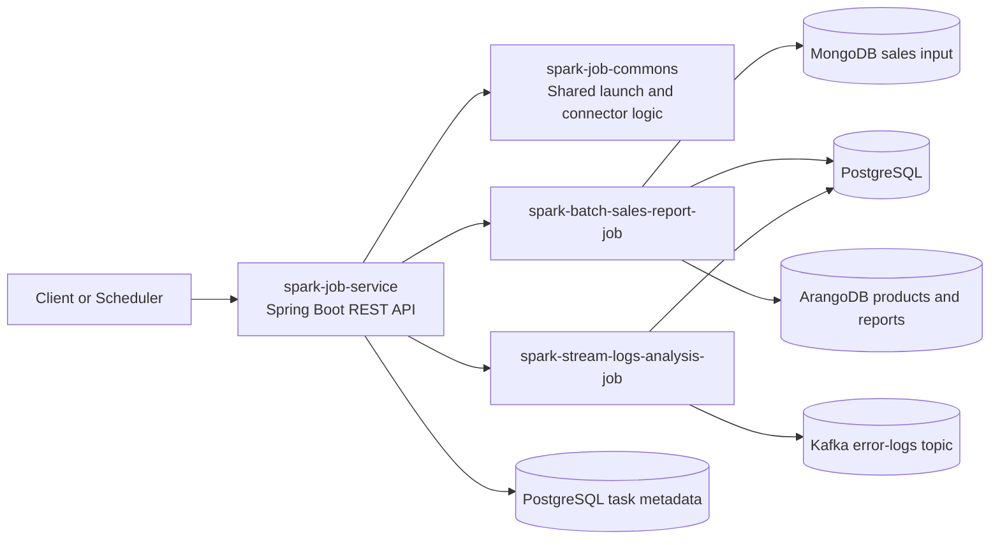
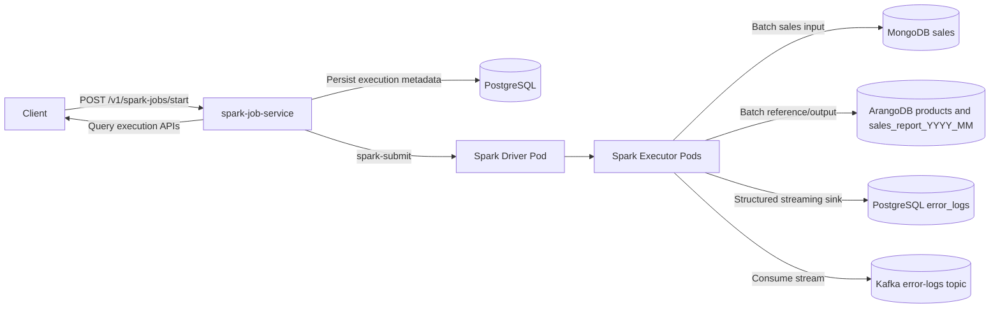
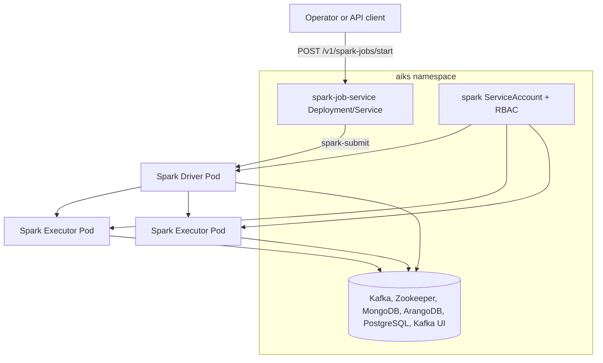
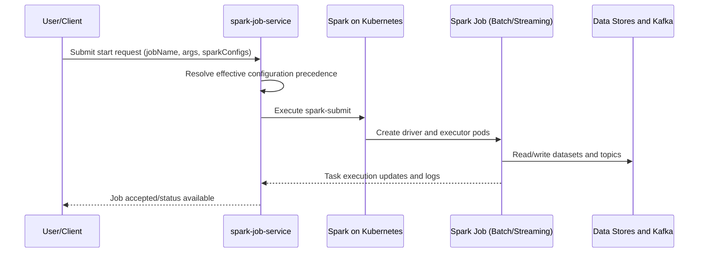
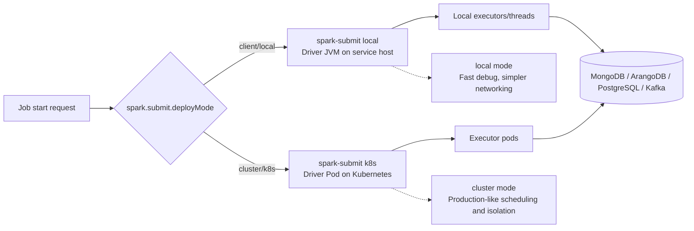

# Project Architecture

This document contains project-level runtime and deployment diagrams.

For complementary details, see:

- [Spring Boot Framework](SPRING_BOOT_FRAMEWORK.md) for module framework coverage, service flow, and Spring annotation usage.
- [Design Patterns](DESIGN_PATTERNS.md) for class-diagram-focused pattern documentation.
- [Spark Job Service API](SPARK_JOB_SERVICE_API.md) for endpoint-level behavior.

## Components Diagram (Mermaid)

## Dataflow Diagram (Mermaid)

## Deployment Diagram (Mermaid)

## End-to-End Architecture Flow (Mermaid)

## Local Deployment View (Mermaid)

```mermaid
flowchart LR
  User[REST client or Scheduler] --> SVC[spark-job-service\nlocal profile]
  Req[SalesReportJobLaunchRequest\nmonth, sparkConfigs] --> SVC

  subgraph Configs[Configuration Inputs]
    C1[spark-job-service\napplication-local.yml]
    C2[M2_REPO jar path]
    C3[SPARK_HOME]
  end

  C1 --> SVC
  C2 --> Submit
  C3 --> Submit

  SVC --> Submit[spark-submit\nmaster=local\ndeployMode=client]

  subgraph JVM["Driver JVM - local process"]
    SS[SparkSession]
    EX[Executor threads]
    JAR[spark-batch-sales-report-job.jar]
  end

  Submit --> SS
  SS --> EX
  JAR --> SS

  EX --> Mongo[(MongoDB sales)]
  EX --> Arango[(ArangoDB products and sales_report_YYYY_MM)]
  EX --> Postgres[(PostgreSQL task metadata)]
```

## Deploy Modes View (Mermaid)

