# Design Patterns Used in This Project

This document centralizes common Spring Boot patterns and module-level design patterns used across the repository.

## 1) Dependency Injection (Constructor-based)

Primary examples:
- [SparkJobController](../spark-job-service/src/main/java/com/aiks/spark/api/SparkJobController.java)
- [SparkPipelineExecutor (stream)](../spark-stream-logs-analysis-job/src/main/java/com/aiks/spark/loganalysis/SparkPipelineExecutor.java)

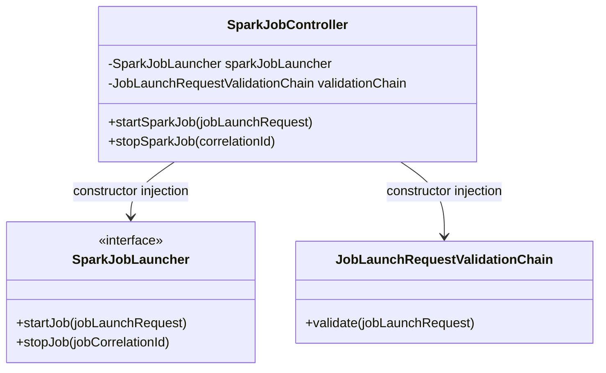

## 2) REST Controller Layer

Primary example:
- [SparkJobController](../spark-job-service/src/main/java/com/aiks/spark/api/SparkJobController.java)

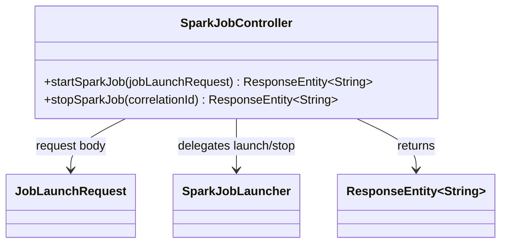

## 3) Java Config + Bean Factory Methods

Primary example:
- [SparkJobServiceConfiguration](../spark-job-service/src/main/java/com/aiks/spark/conf/SparkJobServiceConfiguration.java)

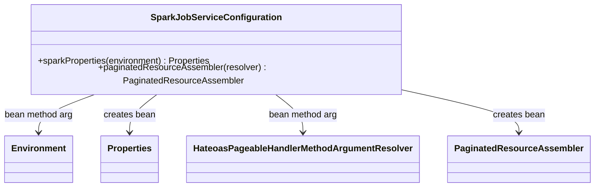

## 4) Externalized Type-safe Configuration

Primary example:
- [ConnectorProperties](../spark-job-commons/src/main/java/com/aiks/spark/common/config/properties/ConnectorProperties.java)

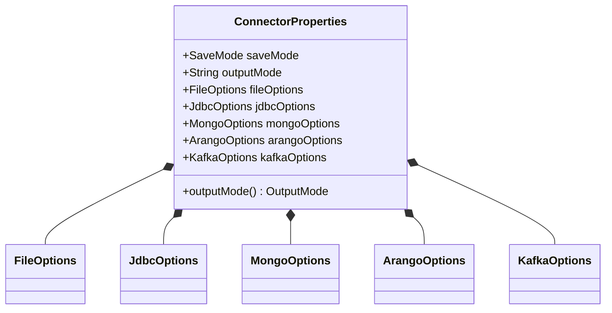

## 5) Auto-Configuration + Conditional Beans

Primary example:
- [SparkCommonsConfiguration](../spark-job-commons/src/main/java/com/aiks/spark/common/config/SparkCommonsConfiguration.java)


## 6) Startup Runner Pattern (ApplicationRunner)

Primary examples:
- [SalesReportJob](../spark-batch-sales-report-job/src/main/java/com/aiks/spark/sales/SalesReportJob.java)
- [LogAnalysisJob](../spark-stream-logs-analysis-job/src/main/java/com/aiks/spark/loganalysis/LogAnalysisJob.java)

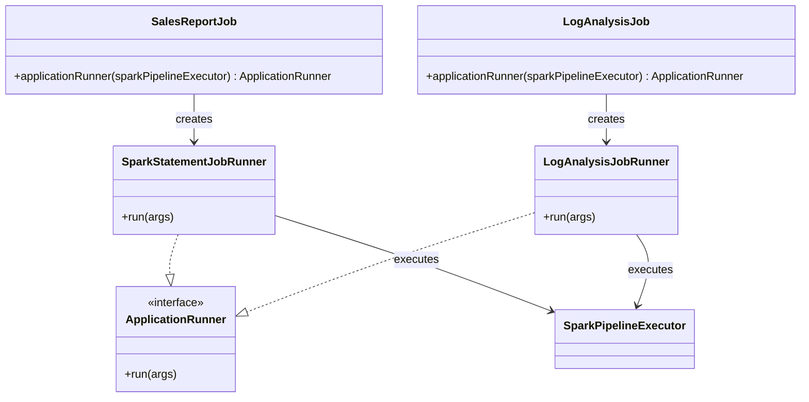

## 7) Event/Listener-driven Lifecycle Handling

Primary example:
- [SparkExecutionManager](../spark-job-commons/src/main/java/com/aiks/spark/common/SparkExecutionManager.java)

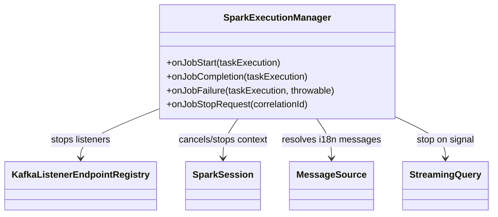

## 8) Validation Pipeline (Chain of Responsibility style)

Primary examples:
- [JobLaunchRequestValidationChain](../spark-job-service/src/main/java/com/aiks/spark/validation/JobLaunchRequestValidationChain.java)
- [JobNameValidator](../spark-job-service/src/main/java/com/aiks/spark/validation/JobNameValidator.java)
- [CorrelationIdValidator](../spark-job-service/src/main/java/com/aiks/spark/validation/CorrelationIdValidator.java)

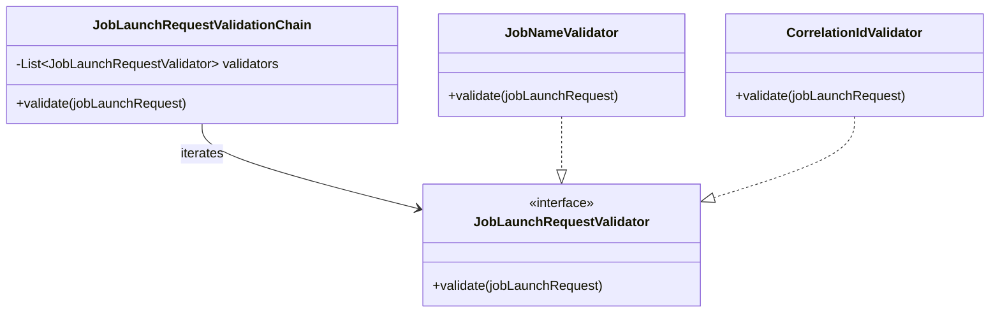

## 9) Factory Pattern (Module-level)

Primary examples:
- [ConnectorFactory](../spark-job-commons/src/main/java/com/aiks/spark/common/connector/ConnectorFactory.java)
- [ConnectorType](../spark-job-commons/src/main/java/com/aiks/spark/common/connector/ConnectorType.java)

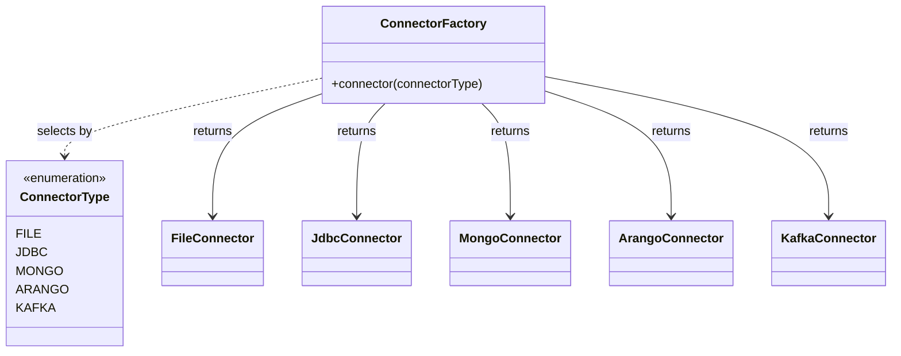

## 10) Template Method Pattern (Module-level)

Primary examples:
- [SalesReportPipelineTemplate](../spark-batch-sales-report-job/src/main/java/com/aiks/spark/sales/pipeline/SalesReportPipelineTemplate.java)
- [SparkPipelineExecutor (batch)](../spark-batch-sales-report-job/src/main/java/com/aiks/spark/sales/SparkPipelineExecutor.java)

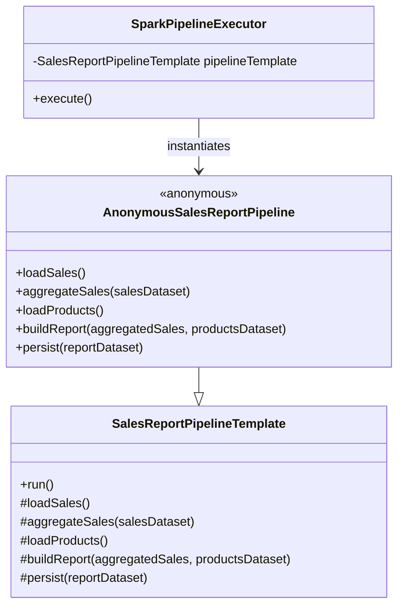

## 11) Strategy Pattern (Module-level)

Primary examples:
- [ErrorLogParserStrategy](../spark-stream-logs-analysis-job/src/main/java/com/aiks/spark/loganalysis/parser/ErrorLogParserStrategy.java)
- [RegexErrorLogParserStrategy](../spark-stream-logs-analysis-job/src/main/java/com/aiks/spark/loganalysis/parser/RegexErrorLogParserStrategy.java)
- [SparkPipelineExecutor (stream)](../spark-stream-logs-analysis-job/src/main/java/com/aiks/spark/loganalysis/SparkPipelineExecutor.java)

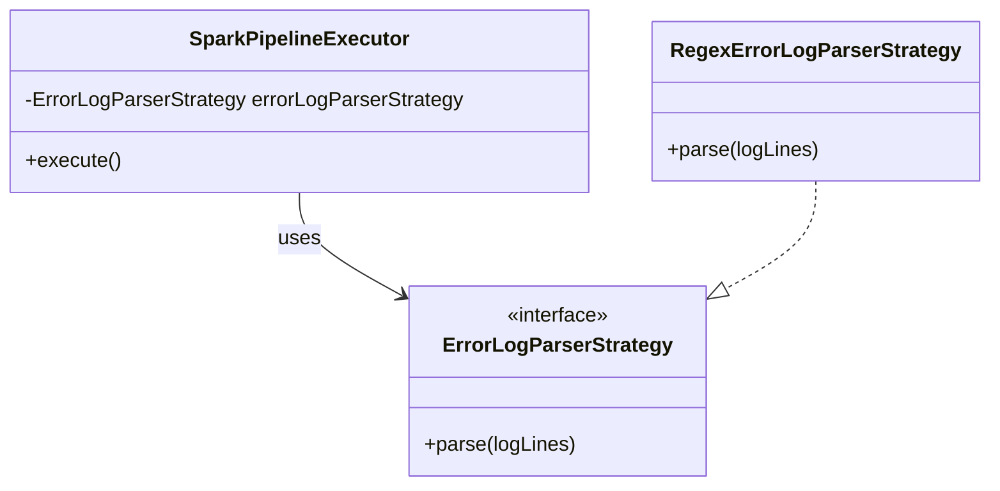

---

## Spring Boot Framework Patterns

This section covers the Spring Boot architecture layers and request flow as implemented across this project. These are not abstract patterns — each subsection maps directly to concrete classes and annotations in use.

### Spring Boot Architecture Layers

The service is structured into four horizontal layers. Each layer has a single responsibility and communicates only with the layer immediately below it.

| Layer | Responsibility | Key Classes |
|---|---|---|
| **REST (Presentation)** | Expose HTTP endpoints, bind and validate request bodies, return `ResponseEntity` | `SparkJobController`, `SparkJobExplorerController` |
| **Validation** | Apply pre-launch rules via a chain of validators before the request reaches the launcher | `JobLaunchRequestValidationChain`, `JobNameValidator`, `CorrelationIdValidator` |
| **Launcher (Service)** | Build the `spark-submit` command, execute it asynchronously, publish stop signals to Kafka | `SparkJobLauncher` (interface), `AbstractSparkJobLauncher`, `SparkSubmitJobLauncher`, `SparkEmrJobLauncher` |
| **Configuration** | Bind `application.yml` properties to typed beans, produce shared infrastructure beans | `SparkJobServiceConfiguration`, `SparkLauncherProperties`, `SparkJobProperties` |

```mermaid
flowchart TB
    subgraph REST["REST Layer (@RestController)"]
        SJC["SparkJobController\n@RestController\n@RequestMapping /v1/spark-jobs"]
        SJEC["SparkJobExplorerController\n@RestController\n@ConditionalOnProperty\npersist-jobs=true"]
    end

    subgraph VALIDATION["Validation Layer (@Component)"]
        CHAIN["JobLaunchRequestValidationChain\n@Component"]
        JNV["JobNameValidator"]
        CIV["CorrelationIdValidator"]
        CHAIN --> JNV
        CHAIN --> CIV
    end

    subgraph LAUNCHER["Launcher Layer (Service)"]
        IFACE["SparkJobLauncher\n<<interface>>"]
        ABS["AbstractSparkJobLauncher\n<<abstract>>"]
        SUBMIT["SparkSubmitJobLauncher\n@Component\nsparkSubmit + KafkaTemplate"]
        EMR["SparkEmrJobLauncher\n@Component\nAWS EMR launcher"]
        IFACE <|.. ABS
        ABS <|-- SUBMIT
        ABS <|-- EMR
    end

    subgraph CONFIG["Configuration Layer"]
        SLP["SparkLauncherProperties\n@ConfigurationProperties\nprefix=spark-launcher"]
        SJP["SparkJobProperties\nper-job conf + env"]
        SJSC["SparkJobServiceConfiguration\n@Configuration\n@Bean sparkProperties\n@Bean paginatedResourceAssembler"]
        SLP --> SJP
    end

    SJC --> CHAIN
    SJC --> IFACE
    IFACE --> SUBMIT
    IFACE --> EMR
    SUBMIT --> SLP
    SJSC --> SLP
```

---

### Spring Boot Flow Architecture

The diagrams below trace the two primary HTTP flows end-to-end: submitting a job and stopping one.

#### Start Job Flow — `POST /v1/spark-jobs/start`

An HTTP request body is deserialised into a `JobLaunchRequest`, validated, then handed to `SparkSubmitJobLauncher` which builds and runs a `spark-submit` process asynchronously via a cached thread pool. The response is returned immediately as HTTP 202 Accepted while the job runs in the background.

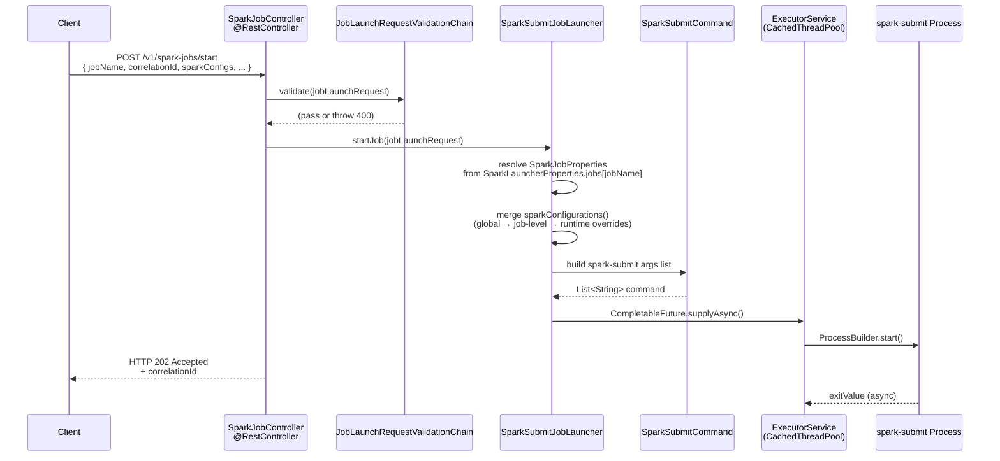

#### Stop Job Flow — `POST /v1/spark-jobs/stop/{correlationId}`

Stopping a job is signal-based. The service publishes the `correlationId` to a Kafka topic. Inside the running Spark job, `SparkExecutionManager` consumes that topic and tears down the streaming query or cancels the Spark context.

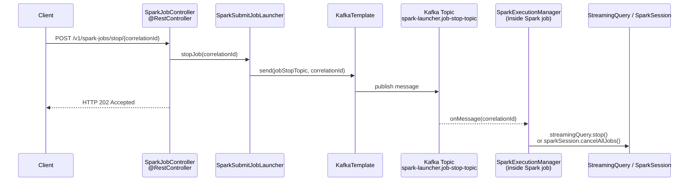

#### Key Spring Boot Annotations in Use

| Annotation | Location | Purpose |
|---|---|---|
| `@RestController` + `@RequestMapping` | `SparkJobController`, `SparkJobExplorerController` | Declare HTTP endpoints; return `ResponseEntity` automatically serialised to JSON |
| `@RequiredArgsConstructor` (Lombok) | Controllers, validators, launchers | Generate constructor injection without boilerplate |
| `@ConfigurationProperties(prefix=…)` | `SparkLauncherProperties` | Bind all `spark-launcher.*` YAML keys to a validated typed POJO |
| `@Validated` | `SparkLauncherProperties`, `SparkJobProperties` | Enforce JSR-303 constraints (`@NotEmpty`, `@NotNull`) on config at startup |
| `@Configuration` + `@Bean` | `SparkJobServiceConfiguration` | Produce shared beans (e.g., `sparkProperties`, `paginatedResourceAssembler`) |
| `@ConditionalOnProperty` | `SparkJobExplorerController` | Activate the execution-history controller only when `persist-jobs=true` |
| `@PreDestroy` | `SparkSubmitJobLauncher` | Shutdown the cached thread pool cleanly on application stop |
| `@Tag`, `@Operation`, `@ApiResponses` | Both controllers | Auto-generate OpenAPI 3 documentation via Springdoc |
| `@Component` | `JobLaunchRequestValidationChain`, validators | Register as Spring-managed beans; list auto-collected by Spring for the chain |
