# Design Patterns Used in This Project

This document centralizes module-level design patterns used across the repository.
For Spring Boot architecture layers, request flow diagrams, and annotation reference, see [Spring Boot Framework Patterns](SPRING_BOOT_FRAMEWORK.md).

## 1) Dependency Injection (Constructor-based)

Primary examples:
- [SparkJobController](../spark-job-service/src/main/java/com/aiks/spark/api/SparkJobController.java)
- [SparkPipelineExecutor (stream)](../spark-stream-logs-analysis-job/src/main/java/com/aiks/spark/loganalysis/SparkPipelineExecutor.java)

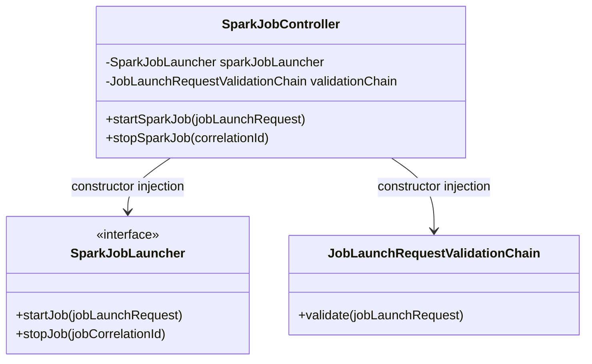

## 2) REST Controller Layer

Primary example:
- [SparkJobController](../spark-job-service/src/main/java/com/aiks/spark/api/SparkJobController.java)

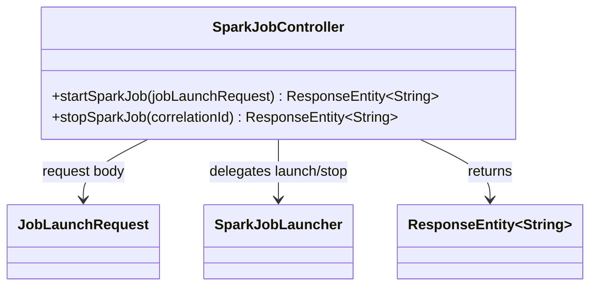

## 3) Java Config + Bean Factory Methods

Primary example:
- [SparkJobServiceConfiguration](../spark-job-service/src/main/java/com/aiks/spark/conf/SparkJobServiceConfiguration.java)

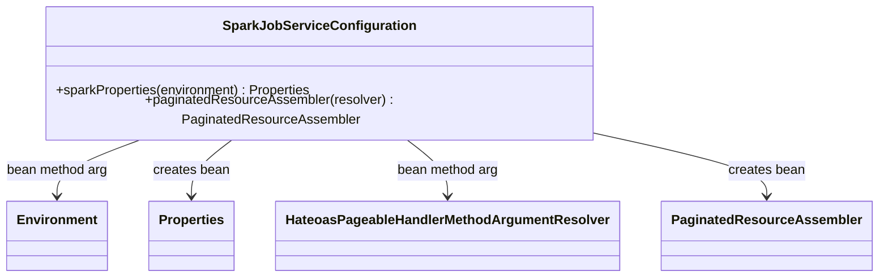

## 4) Externalized Type-safe Configuration

Primary example:
- [ConnectorProperties](../spark-job-commons/src/main/java/com/aiks/spark/common/config/properties/ConnectorProperties.java)

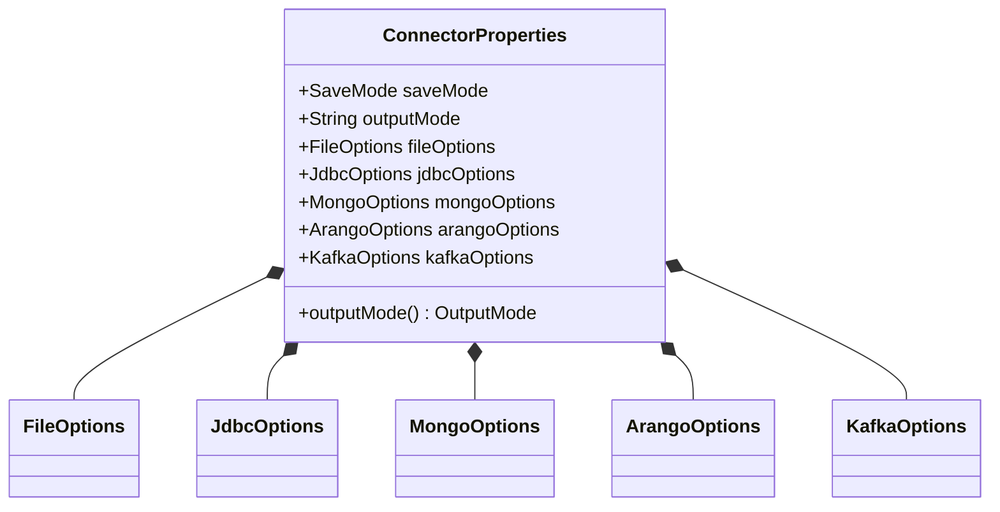

## 5) Auto-Configuration + Conditional Beans

Primary example:
- [SparkCommonsConfiguration](../spark-job-commons/src/main/java/com/aiks/spark/common/config/SparkCommonsConfiguration.java)

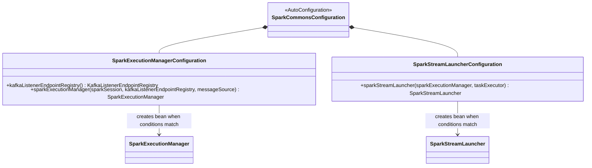

## 6) Startup Runner Pattern (ApplicationRunner)

Primary examples:
- [SalesReportJob](../spark-batch-sales-report-job/src/main/java/com/aiks/spark/sales/SalesReportJob.java)
- [LogAnalysisJob](../spark-stream-logs-analysis-job/src/main/java/com/aiks/spark/loganalysis/LogAnalysisJob.java)

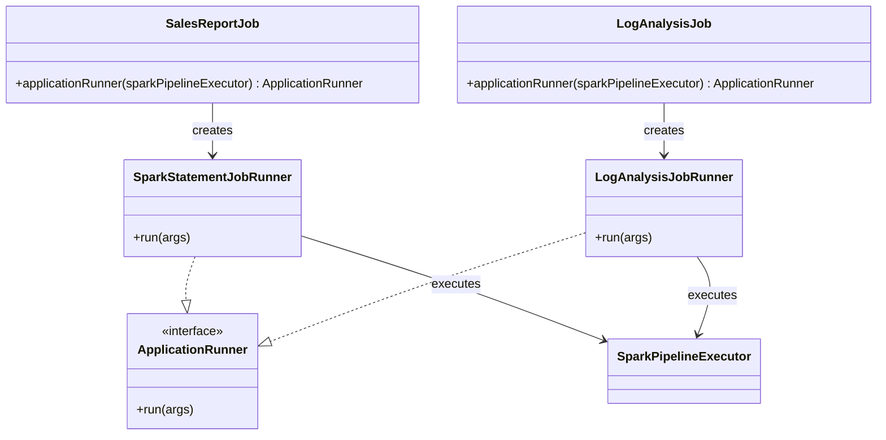

## 7) Event/Listener-driven Lifecycle Handling

Primary example:
- [SparkExecutionManager](../spark-job-commons/src/main/java/com/aiks/spark/common/SparkExecutionManager.java)

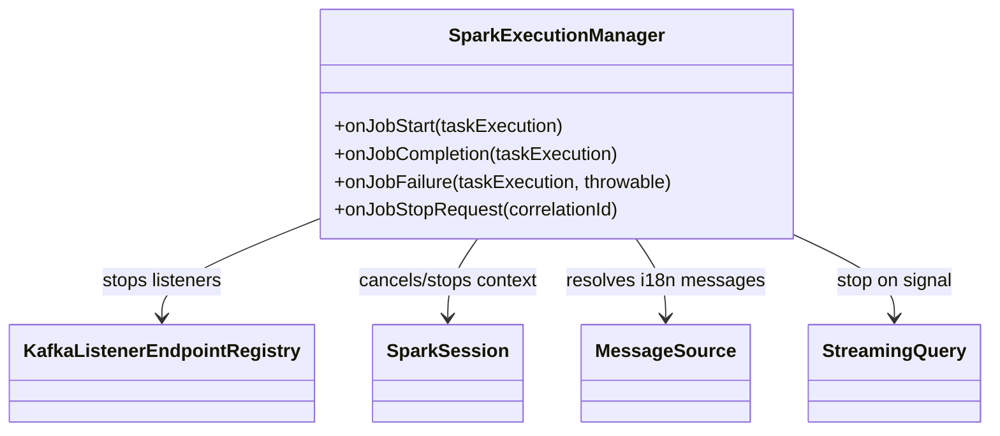

## 8) Validation Pipeline (Chain of Responsibility style)

Primary examples:
- [JobLaunchRequestValidationChain](../spark-job-service/src/main/java/com/aiks/spark/validation/JobLaunchRequestValidationChain.java)
- [JobNameValidator](../spark-job-service/src/main/java/com/aiks/spark/validation/JobNameValidator.java)
- [CorrelationIdValidator](../spark-job-service/src/main/java/com/aiks/spark/validation/CorrelationIdValidator.java)

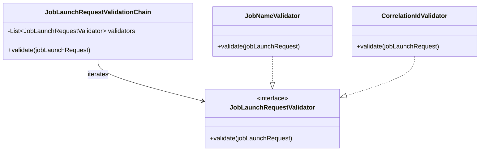

## 9) Factory Pattern (Module-level)

Primary examples:
- [ConnectorFactory](../spark-job-commons/src/main/java/com/aiks/spark/common/connector/ConnectorFactory.java)
- [ConnectorType](../spark-job-commons/src/main/java/com/aiks/spark/common/connector/ConnectorType.java)

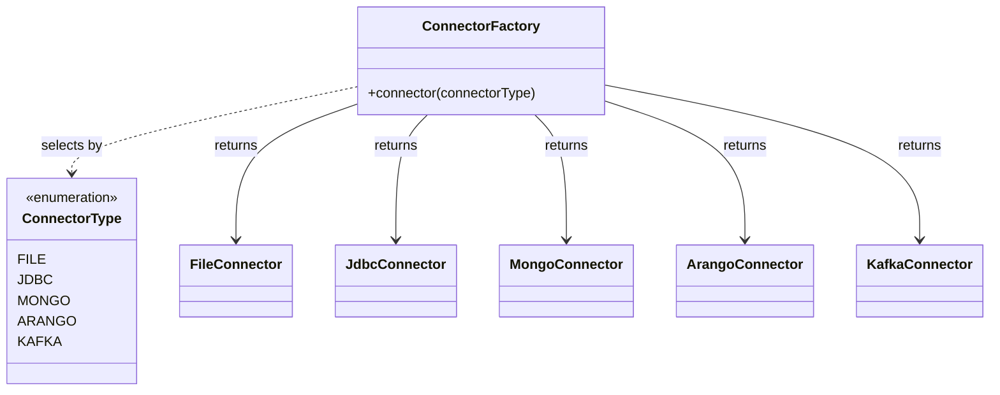

## 10) Template Method Pattern (Module-level)

Primary examples:
- [SalesReportPipelineTemplate](../spark-batch-sales-report-job/src/main/java/com/aiks/spark/sales/pipeline/SalesReportPipelineTemplate.java)
- [SparkPipelineExecutor (batch)](../spark-batch-sales-report-job/src/main/java/com/aiks/spark/sales/SparkPipelineExecutor.java)

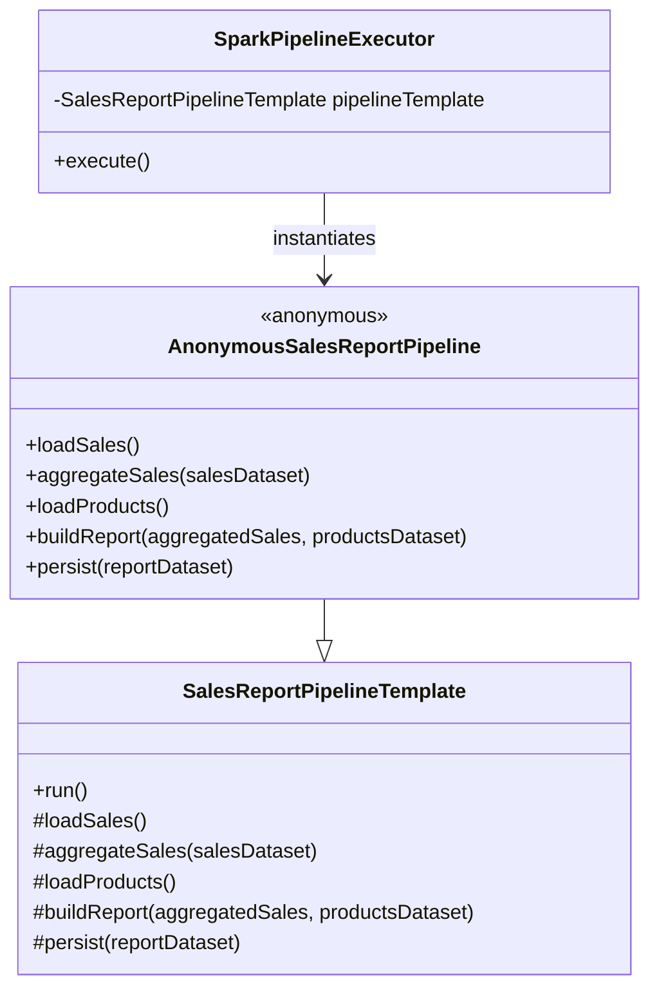

## 11) Strategy Pattern (Module-level)

Primary examples:
- [ErrorLogParserStrategy](../spark-stream-logs-analysis-job/src/main/java/com/aiks/spark/loganalysis/parser/ErrorLogParserStrategy.java)
- [RegexErrorLogParserStrategy](../spark-stream-logs-analysis-job/src/main/java/com/aiks/spark/loganalysis/parser/RegexErrorLogParserStrategy.java)
- [SparkPipelineExecutor (stream)](../spark-stream-logs-analysis-job/src/main/java/com/aiks/spark/loganalysis/SparkPipelineExecutor.java)

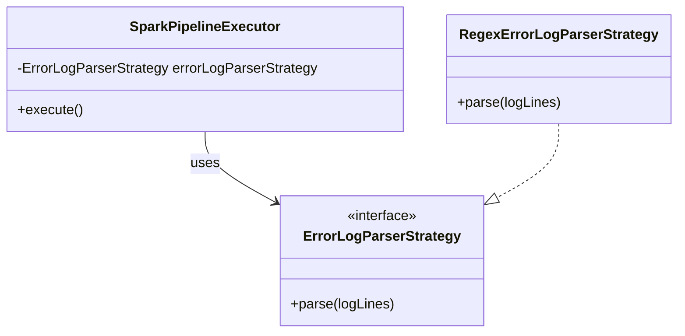
