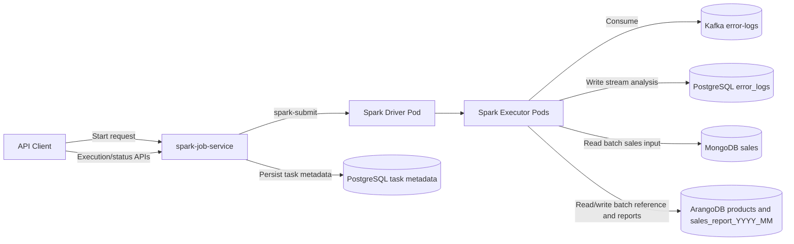
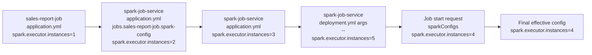
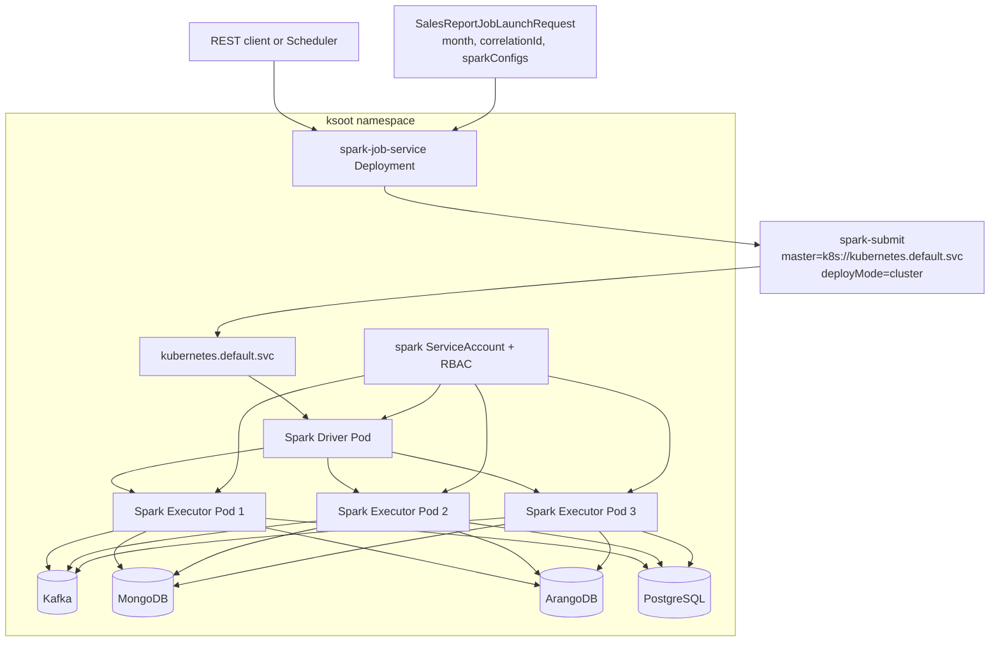

# Local Development Operations Runbook

This runbook is organized into three distinct end-to-end paths:

- End-to-end A: Docker Compose (local infra + local app runs)
- End-to-end B: Minikube + Kubernetes manifests
- End-to-end C: Helm (optional infra path)

Choose one path and follow it start-to-finish.

## How to Read These Diagrams

- Runtime Dataflow Diagram: shows request and data movement between API, Spark, and storage systems.
- Configuration Precedence Diagram: shows override order; the right-most source wins when values conflict.
- Cluster Deployment Diagram: shows Kubernetes runtime topology (service, driver, executors, RBAC, and infra dependencies).

## Runtime Dataflow Diagram



## Configuration Precedence Diagram



## 1. Common Prerequisites

- Java 21
- Maven (`mvn`)
- Docker Desktop
- Optional for Kubernetes paths:
  - `kubectl`
  - Minikube
  - Helm

Useful helper command:

```bash
make help
```

## 2. End-to-End A: Docker Compose

Use this path when you want to run infra locally with Docker Compose and run Spring Boot apps from your machine.

### 2.1 Start Infrastructure

```bash
set -a
source .env
set +a

docker compose -f docker/docker-compose.yml up -d
docker compose -f docker/docker-compose.yml ps
```

Default local values are in `.env`. Update `.env` before running in shared environments.

### 2.2 Build Artifacts

```bash
mvn clean package -DskipTests
```

### 2.3 Run Spark Job Service Locally

```bash
cd spark-job-service
mvn spring-boot:run -Dspring-boot.run.profiles=local
```

### 2.4 Verify API Availability

In another terminal:

```bash
curl -s -o /tmp/spark_job_service_response.json -w '%{http_code}' http://localhost:8090/v3/api-docs && echo
head -c 220 /tmp/spark_job_service_response.json
```

Expected HTTP status: `200`.

### 2.5 Submit a Job

```bash
curl -X POST 'http://localhost:8090/v1/spark-jobs/start' \
  -H 'Content-Type: application/json' \
  -d '{
    "jobName": "sales-report-job",
    "jobArguments": {
      "month": "2024-11"
    }
  }'
```

### 2.6 Stop a Running Job (Optional)

```bash
curl -X POST 'http://localhost:8090/v1/spark-jobs/stop/<correlation-id>'
```

### 2.7 Cleanup Docker Compose

```bash
docker compose -f docker/docker-compose.yml down
```

## 3. End-to-End B: Minikube + Kubernetes Manifests

Use this path for full Kubernetes execution using the repository manifests.

### 3.0 Cluster Deployment Diagram



### 3.1 Quick Path (Makefile)

```bash
make mk-start
make mk-build mk-images
make mk-namespace mk-secrets
make mk-deploy mk-rollout-status
make mk-smoke
```

For teardown:

```bash
make mk-cleanup-all
```

### 3.2 Manual Path

#### 3.2.1 Start Minikube

```bash
minikube start --driver=docker --cpus=4 --memory=6144 -p minikube
kubectl config use-context minikube
kubectl get nodes
```

If needed for `LoadBalancer` services:

```bash
minikube tunnel
```

#### 3.2.2 Build Images in Minikube Docker

```bash
eval "$(minikube -p minikube docker-env)"
mvn clean package -DskipTests

docker build -t ksoot/spark:4.0.0 -f docker/Dockerfile docker
docker build -t spark-job-service:0.0.1 ./spark-job-service
docker build -t spark-batch-sales-report-job:0.0.1 ./spark-batch-sales-report-job
docker build -t spark-stream-logs-analysis-job:0.0.1 ./spark-stream-logs-analysis-job
```

#### 3.2.3 Create Namespace and Secrets

```bash
kubectl create namespace ksoot --dry-run=client -o yaml | kubectl apply -f -
kubectl apply -n ksoot -f k8s/platform-secrets-dev.yaml
```

#### 3.2.4 Deploy Infra + RBAC + App

```bash
kubectl apply -f k8s/infra-kubernetes-deploy.yml
kubectl apply -f k8s/spark-rbac.yml
kubectl apply -f k8s/deployment.yml
```

#### 3.2.5 Verify Rollout

```bash
kubectl rollout status deployment/postgres -n ksoot --timeout=300s
kubectl rollout status deployment/kafka-ui -n ksoot --timeout=300s
kubectl rollout status deployment/spark-job-service -n ksoot --timeout=300s
kubectl get pods -n ksoot -o wide
kubectl get svc -n ksoot
```

#### 3.2.6 Submit Jobs (In-cluster, no port-forward needed)

```bash
CURRENT_MONTH=$(date +%Y-%m)

kubectl run sales-submit --rm -i --restart=Never -n ksoot --image=curlimages/curl:8.10.1 -- \
  -sS -X POST http://spark-job-service:8090/v1/spark-jobs/start \
  -H 'Content-Type: application/json' \
  -d '{"jobName":"sales-report-job","jobArguments":{"month":"'"$$CURRENT_MONTH"'"}}'

kubectl run logs-submit --rm -i --restart=Never -n ksoot --image=curlimages/curl:8.10.1 -- \
  -sS -X POST http://spark-job-service:8090/v1/spark-jobs/start \
  -H 'Content-Type: application/json' \
  -d '{"jobName":"logs-analysis-job"}'

kubectl get pods -n ksoot --sort-by=.metadata.creationTimestamp | tail -n 12
```

For the Makefile quick path, `make mk-smoke` now verifies both the ArangoDB `products` collection and the generated `sales_report_YYYY_MM` collection for `SALES_MONTH`.

#### 3.2.7 Host Access via Port Forward (Optional)

Use these when you need to access in-cluster endpoints directly from your host for troubleshooting or UI checks. Keep each command running in its own terminal while you use the forwarded port.

Common forwards:

```bash
# Spark Job Service API
kubectl port-forward -n ksoot svc/spark-job-service 8090:8090

# PostgreSQL
kubectl port-forward -n ksoot svc/postgres 5432:5432

# Kafka UI
kubectl port-forward -n ksoot svc/kafka-ui 8100:8100

# Spark UI for currently running driver pod (batch/stream)
DRIVER_POD=$(kubectl get pods -n ksoot -l spark-role=driver --field-selector=status.phase=Running -o jsonpath='{.items[0].metadata.name}')
kubectl port-forward -n ksoot pod/${DRIVER_POD} 4040:4040
```

Equivalent Make targets:

```bash
make mk-port-forward
make mk-port-forward-postgres
make mk-port-forward-kafka-ui
make mk-port-forward-arango
make mk-port-forward-spark-ui
```

Spark UI opens at `http://localhost:4040`.

If the selected driver has already completed, choose another running driver pod from `kubectl get pods -n ksoot -l spark-role=driver`.

If it fails with exit code `1`:

```bash
kubectl get svc -n ksoot spark-job-service
kubectl get pods -n ksoot -l name=spark-job-service -o wide
lsof -nP -iTCP:8090 -sTCP:LISTEN
SPARK_JOB_SERVICE_POD=$(kubectl get pods -n ksoot -l name=spark-job-service -o jsonpath='{.items[0].metadata.name}')
kubectl port-forward -n ksoot pod/${SPARK_JOB_SERVICE_POD} 8090:8090
```

#### 3.2.8 Validate MongoDB Data

MongoDB runs in-cluster as service `mongo` on port `27017` with no username/password configured in the Kubernetes manifest.

Quick health check:

```bash
kubectl exec -n ksoot deployment/mongo -- mongosh --quiet --eval 'db.adminCommand({ ping: 1 })'
```

Open an interactive shell inside the MongoDB pod:

```bash
kubectl exec -it -n ksoot deployment/mongo -- mongosh
```

Useful interactive queries:

```javascript
show dbs
use sales_db
show collections
db.sales.find().limit(5)
```

Run one-shot queries without opening an interactive shell:

```bash
kubectl exec -n ksoot deployment/mongo -- mongosh --quiet --eval 'db.adminCommand({ listDatabases: 1 })'
kubectl exec -n ksoot deployment/mongo -- mongosh --quiet sales_db --eval 'show collections'
kubectl exec -n ksoot deployment/mongo -- mongosh --quiet sales_db --eval 'db.sales.countDocuments()'
kubectl exec -n ksoot deployment/mongo -- mongosh --quiet sales_db --eval 'db.sales.find().limit(5).toArray()'
```

Optional host access via port-forward:

```bash
kubectl port-forward -n ksoot svc/mongo 27017:27017
mongosh 'mongodb://localhost:27017'
```

Then run locally in `mongosh`:

```javascript
show dbs
use sales_db
show collections
db.sales.find().limit(5)
```

#### 3.2.9 Validate ArangoDB Data

ArangoDB runs in-cluster as service `arango` on port `8529` with authentication enabled.

Current credentials in the development manifest:

- Username: `root`
- Password: `admin`

Quick API check from inside the pod:

```bash
kubectl exec -n ksoot deployment/arango -- sh -lc 'wget -qO- http://127.0.0.1:8529/_api/version'
```

Expected result is `401 Unauthorized`, which confirms the ArangoDB server is running and enforcing authentication.

Host access via port-forward:

```bash
kubectl port-forward -n ksoot svc/arango 8529:8529
```

Equivalent Make target:

```bash
make mk-port-forward-arango
```

Open the ArangoDB web UI:

```text
http://localhost:8529
```

Login with:

- Username: `root`
- Password: `admin`

Query with `arangosh` from your machine:

```bash
arangosh --server.endpoint http+tcp://127.0.0.1:8529 --server.username root --server.password
```

Useful queries in `arangosh`:

```javascript
db._databases()
db._useDatabase("products_db")
db._collections().map(c => c.name())
db._query("FOR d IN your_collection LIMIT 5 RETURN d").toArray()
db._query("FOR d IN your_collection COLLECT WITH COUNT INTO n RETURN n").toArray()
```

If `kubectl port-forward` exits immediately with code `1`, check whether port `8529` is already in use:

```bash
lsof -nP -iTCP:8529 -sTCP:LISTEN
```

#### 3.2.10 Cleanup Minikube Path

```bash
make mk-cleanup
# optional full teardown including minikube profile
make mk-cleanup-all
```

## 4. End-to-End C: Helm (Optional Infra Path)

Use this path when you want Helm-managed platform components (`conduktor`, `postgres`, `kafka`, `zookeeper`).

Note: Helm chart in this repository manages platform infra components, not the `spark-job-service` deployment itself. Keep `k8s/deployment.yml` flow for `spark-job-service`.

### 4.0 Prerequisite: Running Kubernetes Context

Before section 4.1, ensure a Kubernetes cluster is running and `kubectl` is pointing to it.

For Minikube:

```bash
make mk-start
kubectl config use-context minikube
```

### 4.1 Prepare Namespace and Shared Secret

```bash
kubectl config use-context minikube
kubectl create namespace ksoot --dry-run=client -o yaml | kubectl apply --validate=false -f -
kubectl config set-context --current --namespace=ksoot
kubectl apply -n ksoot --validate=false -f k8s/platform-secrets-dev.yaml
```

### 4.2 Install or Upgrade Helm Release

```bash
helm upgrade --install local-release ./helm -n ksoot -f helm/values-dev.yaml \
  --set platformSecrets.existingSecret=platform-secrets
```

Equivalent target:

```bash
make helm-install
```

### 4.3 Verify Helm Components

```bash
kubectl rollout status deployment/postgres -n ksoot --timeout=300s
kubectl rollout status deployment/zookeeper -n ksoot --timeout=300s
kubectl rollout status deployment/kafka -n ksoot --timeout=300s
kubectl rollout status deployment/conduktor -n ksoot --timeout=300s
kubectl get pods -n ksoot -o wide
kubectl get svc -n ksoot
```

### 4.4 Access Conduktor

```bash
minikube service -n ksoot conduktor --url
```

Credentials source:

- Admin email from `helm/values-dev.yaml` (`conduktor.adminEmail`)
- Admin password from `k8s/platform-secrets-dev.yaml` (`cdk-admin-password`)
- Analyst password from `k8s/platform-secrets-dev.yaml` (`conduktor-analyst-password`)

### 4.5 Deploy/Verify Spark Job Service (if not already running)

```bash
kubectl apply -f k8s/spark-rbac.yml
kubectl apply -f k8s/deployment.yml
kubectl rollout status deployment/spark-job-service -n ksoot --timeout=300s
```

### 4.6 Helm Smoke Checks

```bash
kubectl run kafka-check --rm -i --restart=Never -n ksoot --image=busybox:1.36 -- \
  sh -c 'nc -z kafka 9092 && echo "Kafka reachable"'

kubectl run postgres-check --rm -i --restart=Never -n ksoot --image=postgres:15.15 -- \
  sh -c 'PGPASSWORD=admin psql -h postgres -U conduktor -d conduktor -c "select 1"'
```

### 4.7 Uninstall Helm Release

```bash
helm uninstall local-release -n ksoot
kubectl get all -n ksoot
```
