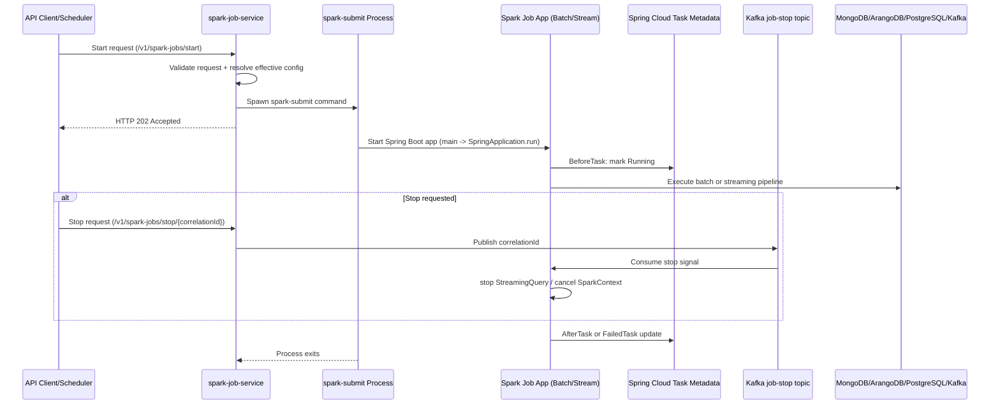
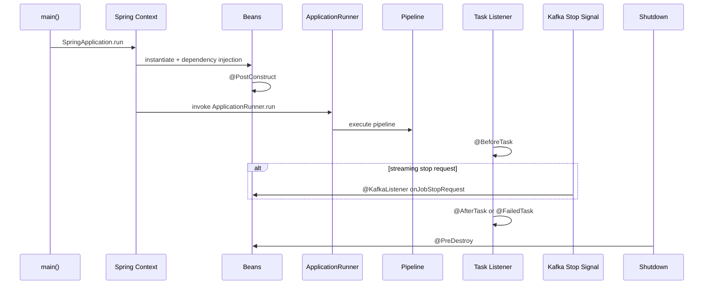
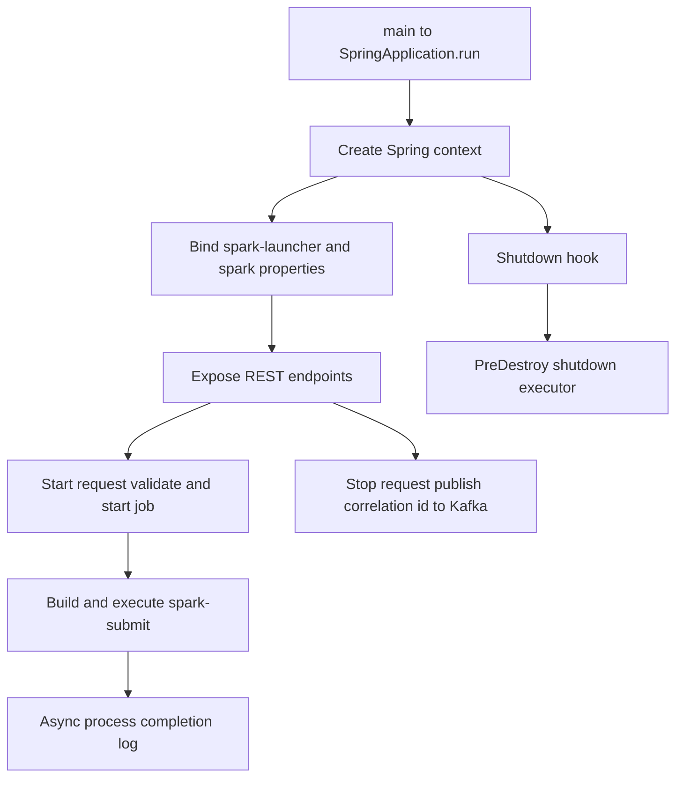
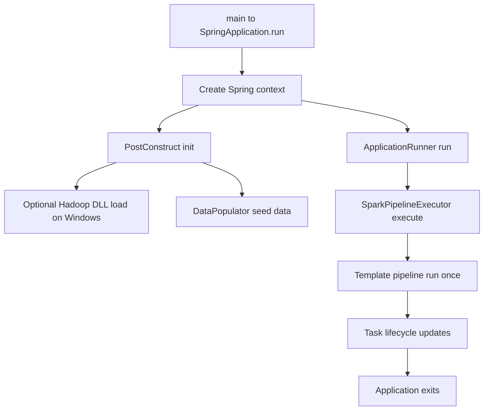
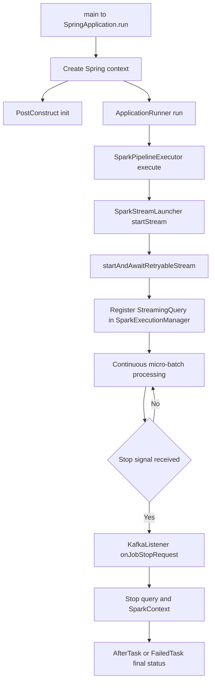

# Spring Application Lifecycle

This document explains the Spring application lifecycle across the full platform, from API startup to Spark job termination.

For framework inventory and module details, see [Spring Boot Framework](SPRING_BOOT_FRAMEWORK.md).
For deployment/runtime topology, see [Architecture](ARCHITECTURE.md).

## End-to-End Lifecycle (Platform View)

## Lifecycle Phases

| Phase | What happens | Primary classes |
|---|---|---|
| 1. Service startup | Spring context starts REST/API launcher service. | [spark-job-service/src/main/java/com/aiks/spark/SparkJobService.java](../spark-job-service/src/main/java/com/aiks/spark/SparkJobService.java) |
| 2. Request handling | Controller validates and delegates to launcher. | [spark-job-service/src/main/java/com/aiks/spark/api/SparkJobController.java](../spark-job-service/src/main/java/com/aiks/spark/api/SparkJobController.java), [spark-job-service/src/main/java/com/aiks/spark/validation/JobLaunchRequestValidationChain.java](../spark-job-service/src/main/java/com/aiks/spark/validation/JobLaunchRequestValidationChain.java) |
| 3. Submit orchestration | Launcher builds command and executes spark-submit asynchronously. | [spark-job-service/src/main/java/com/aiks/spark/launcher/SparkSubmitJobLauncher.java](../spark-job-service/src/main/java/com/aiks/spark/launcher/SparkSubmitJobLauncher.java), [spark-job-service/src/main/java/com/aiks/spark/launcher/SparkSubmitCommand.java](../spark-job-service/src/main/java/com/aiks/spark/launcher/SparkSubmitCommand.java) |
| 4. Job app startup | Job Spring Boot app initializes, binds properties, runs ApplicationRunner. | [spark-batch-sales-report-job/src/main/java/com/aiks/spark/sales/SalesReportJob.java](../spark-batch-sales-report-job/src/main/java/com/aiks/spark/sales/SalesReportJob.java), [spark-stream-logs-analysis-job/src/main/java/com/aiks/spark/loganalysis/LogAnalysisJob.java](../spark-stream-logs-analysis-job/src/main/java/com/aiks/spark/loganalysis/LogAnalysisJob.java) |
| 5. Pipeline execution | Batch executes once; stream executes continuously with retry. | [spark-batch-sales-report-job/src/main/java/com/aiks/spark/sales/SparkPipelineExecutor.java](../spark-batch-sales-report-job/src/main/java/com/aiks/spark/sales/SparkPipelineExecutor.java), [spark-stream-logs-analysis-job/src/main/java/com/aiks/spark/loganalysis/SparkPipelineExecutor.java](../spark-stream-logs-analysis-job/src/main/java/com/aiks/spark/loganalysis/SparkPipelineExecutor.java), [spark-job-commons/src/main/java/com/aiks/spark/common/SparkStreamLauncher.java](../spark-job-commons/src/main/java/com/aiks/spark/common/SparkStreamLauncher.java) |
| 6. Completion/stop/failure | Task listener updates status; stop signal halts stream/context. | [spark-job-commons/src/main/java/com/aiks/spark/common/SparkExecutionManager.java](../spark-job-commons/src/main/java/com/aiks/spark/common/SparkExecutionManager.java) |
| 7. JVM/service shutdown | Executors and listeners are stopped; service launcher thread pool is closed. | [spark-job-service/src/main/java/com/aiks/spark/launcher/SparkSubmitJobLauncher.java](../spark-job-service/src/main/java/com/aiks/spark/launcher/SparkSubmitJobLauncher.java), [spark-job-commons/src/main/java/com/aiks/spark/common/SparkExecutionManager.java](../spark-job-commons/src/main/java/com/aiks/spark/common/SparkExecutionManager.java) |

## Combined Application Lifecycle and Bean Hooks

The table below merges lifecycle phases with bean-level hooks/callbacks used in this project.

| Application phase | Bean hook/callback | Effect in this platform |
|---|---|---|
| Bootstrap | SpringApplication.run | Creates the Spring context for service and Spark job apps. |
| Bean initialization | @PostConstruct | Performs early job setup such as Windows Hadoop DLL load and data preparation hooks. |
| Post-start execution | ApplicationRunner.run | Starts the actual batch/stream pipeline only after context initialization is complete. |
| Runtime asynchronous control | @KafkaListener | Receives stop requests by correlation id and triggers graceful stop logic. |
| Task lifecycle integration | @BeforeTask | Marks task execution start and sets Running state metadata. |
| Task lifecycle integration | @AfterTask | Marks normal completion/stopped state and finalizes task metadata. |
| Task lifecycle integration | @FailedTask | Captures failure details and publishes terminal failure metadata. |
| Streaming resilience | @Retryable | Retries stream start/await path for recoverable streaming failures. |
| Shutdown | @PreDestroy | Cleans up launcher resources (executor thread pool) before JVM exit. |

## Module Lifecycle Details

### spark-job-service Lifecycle

### spark-batch-sales-report-job Lifecycle

### spark-stream-logs-analysis-job Lifecycle

## Spring Lifecycle Hooks Used

| Hook/Mechanism | Purpose | Where used |
|---|---|---|
| SpringApplication.run | Bootstraps each Spring application context. | [spark-job-service/src/main/java/com/aiks/spark/SparkJobService.java](../spark-job-service/src/main/java/com/aiks/spark/SparkJobService.java), [spark-batch-sales-report-job/src/main/java/com/aiks/spark/sales/SalesReportJob.java](../spark-batch-sales-report-job/src/main/java/com/aiks/spark/sales/SalesReportJob.java), [spark-stream-logs-analysis-job/src/main/java/com/aiks/spark/loganalysis/LogAnalysisJob.java](../spark-stream-logs-analysis-job/src/main/java/com/aiks/spark/loganalysis/LogAnalysisJob.java) |
| @PostConstruct | Post-bean initialization setup logic. | [spark-batch-sales-report-job/src/main/java/com/aiks/spark/sales/SalesReportJob.java](../spark-batch-sales-report-job/src/main/java/com/aiks/spark/sales/SalesReportJob.java), [spark-stream-logs-analysis-job/src/main/java/com/aiks/spark/loganalysis/LogAnalysisJob.java](../spark-stream-logs-analysis-job/src/main/java/com/aiks/spark/loganalysis/LogAnalysisJob.java) |
| ApplicationRunner | Starts batch/stream pipeline after context startup. | [spark-batch-sales-report-job/src/main/java/com/aiks/spark/sales/SalesReportJob.java](../spark-batch-sales-report-job/src/main/java/com/aiks/spark/sales/SalesReportJob.java), [spark-stream-logs-analysis-job/src/main/java/com/aiks/spark/loganalysis/LogAnalysisJob.java](../spark-stream-logs-analysis-job/src/main/java/com/aiks/spark/loganalysis/LogAnalysisJob.java) |
| @BeforeTask/@AfterTask/@FailedTask | Tracks Spring Cloud Task state transitions. | [spark-job-commons/src/main/java/com/aiks/spark/common/SparkExecutionManager.java](../spark-job-commons/src/main/java/com/aiks/spark/common/SparkExecutionManager.java) |
| @KafkaListener | Handles asynchronous stop requests by correlation id. | [spark-job-commons/src/main/java/com/aiks/spark/common/SparkExecutionManager.java](../spark-job-commons/src/main/java/com/aiks/spark/common/SparkExecutionManager.java) |
| @PreDestroy | Graceful cleanup for launcher executor resources. | [spark-job-service/src/main/java/com/aiks/spark/launcher/SparkSubmitJobLauncher.java](../spark-job-service/src/main/java/com/aiks/spark/launcher/SparkSubmitJobLauncher.java) |
| @Retryable | Retry stream startup/await path for recoverable failures. | [spark-job-commons/src/main/java/com/aiks/spark/common/SparkStreamLauncher.java](../spark-job-commons/src/main/java/com/aiks/spark/common/SparkStreamLauncher.java) |

## Operational Notes

- Service API responses are asynchronous for start and stop requests; execution continues after HTTP 202.
- Batch lifecycle is finite and exits after one pipeline run.
- Streaming lifecycle is long-running and ends on failure, infrastructure stop, or stop signal.
- Correlation id is the join key across API request, task metadata, and stop-event handling.

## Lifecycle Troubleshooting

Common stuck states and quick checks:

- Stream not stopping after stop API call:
    Check that the stop request correlation id exactly matches `aiks.job.correlation-id` in the running job, and verify the job is listening on `spark-launcher.job-stop-topic`.
    Classes: [spark-job-service/src/main/java/com/aiks/spark/api/SparkJobController.java](../spark-job-service/src/main/java/com/aiks/spark/api/SparkJobController.java), [spark-job-service/src/main/java/com/aiks/spark/launcher/SparkSubmitJobLauncher.java](../spark-job-service/src/main/java/com/aiks/spark/launcher/SparkSubmitJobLauncher.java), [spark-job-commons/src/main/java/com/aiks/spark/common/SparkExecutionManager.java](../spark-job-commons/src/main/java/com/aiks/spark/common/SparkExecutionManager.java)
- Task status not updating (still Running):
    Check that Spring Cloud Task metadata store is reachable (PostgreSQL) and confirm `@AfterTask`/`@FailedTask` hooks execute in `SparkExecutionManager`.
    Classes: [spark-job-commons/src/main/java/com/aiks/spark/common/SparkExecutionManager.java](../spark-job-commons/src/main/java/com/aiks/spark/common/SparkExecutionManager.java), [spark-job-commons/src/main/java/com/aiks/spark/common/config/SpringCloudTaskConfiguration.java](../spark-job-commons/src/main/java/com/aiks/spark/common/config/SpringCloudTaskConfiguration.java)
- Stop signal mismatch (request accepted but no effect):
    Check that producer and consumer resolve the same topic name and environment/profile values, including fallback property keys.
    Classes: [spark-job-service/src/main/java/com/aiks/spark/launcher/SparkSubmitJobLauncher.java](../spark-job-service/src/main/java/com/aiks/spark/launcher/SparkSubmitJobLauncher.java), [spark-job-commons/src/main/java/com/aiks/spark/common/SparkExecutionManager.java](../spark-job-commons/src/main/java/com/aiks/spark/common/SparkExecutionManager.java), [spark-job-service/src/main/java/com/aiks/spark/conf/SparkLauncherProperties.java](../spark-job-service/src/main/java/com/aiks/spark/conf/SparkLauncherProperties.java)
- Streaming query keeps retrying forever:
    Check `SparkStreamLauncher` logs for repeated `StreamRetryableException` and validate Kafka source/sink credentials and network reachability.
    Classes: [spark-job-commons/src/main/java/com/aiks/spark/common/SparkStreamLauncher.java](../spark-job-commons/src/main/java/com/aiks/spark/common/SparkStreamLauncher.java), [spark-stream-logs-analysis-job/src/main/java/com/aiks/spark/loganalysis/SparkPipelineExecutor.java](../spark-stream-logs-analysis-job/src/main/java/com/aiks/spark/loganalysis/SparkPipelineExecutor.java), [spark-job-commons/src/main/java/com/aiks/spark/common/util/StreamRetryableException.java](../spark-job-commons/src/main/java/com/aiks/spark/common/util/StreamRetryableException.java)
- Job process exited but service logs are unclear:
    Check `SparkSubmitJobLauncher` async completion logs and driver/executor logs to distinguish submit success from runtime job failure.
    Classes: [spark-job-service/src/main/java/com/aiks/spark/launcher/SparkSubmitJobLauncher.java](../spark-job-service/src/main/java/com/aiks/spark/launcher/SparkSubmitJobLauncher.java), [spark-job-service/src/main/java/com/aiks/spark/launcher/SparkSubmitCommand.java](../spark-job-service/src/main/java/com/aiks/spark/launcher/SparkSubmitCommand.java)