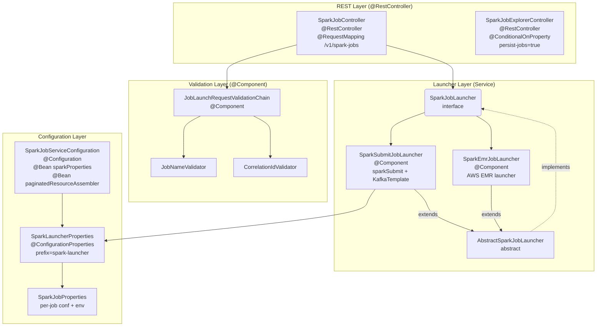
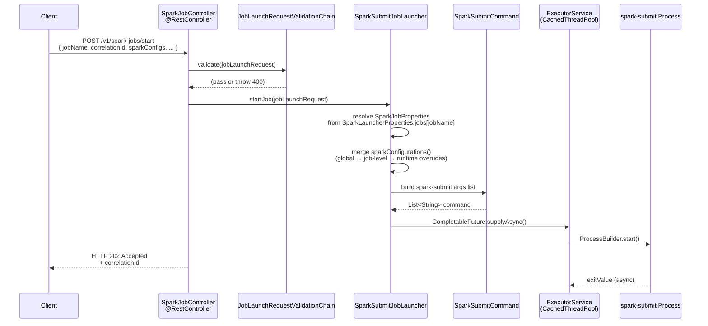
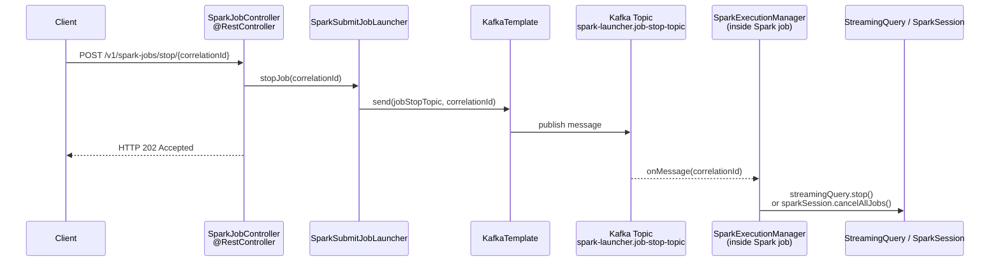

# Spring Boot Framework Patterns

This document covers the Spring Boot architecture layers and request flow as implemented across this project. Each section maps directly to concrete classes and annotations in use.

## Spring Boot Architecture Layers

The service is structured into four horizontal layers. Each layer has a single responsibility and communicates only with the layer immediately below it.

| Layer | Responsibility | Key Classes |
|---|---|---|
| **REST (Presentation)** | Expose HTTP endpoints, bind and validate request bodies, return `ResponseEntity` | `SparkJobController`, `SparkJobExplorerController` |
| **Validation** | Apply pre-launch rules via a chain of validators before the request reaches the launcher | `JobLaunchRequestValidationChain`, `JobNameValidator`, `CorrelationIdValidator` |
| **Launcher (Service)** | Build the `spark-submit` command, execute it asynchronously, publish stop signals to Kafka | `SparkJobLauncher` (interface), `AbstractSparkJobLauncher`, `SparkSubmitJobLauncher`, `SparkEmrJobLauncher` |
| **Configuration** | Bind `application.yml` properties to typed beans, produce shared infrastructure beans | `SparkJobServiceConfiguration`, `SparkLauncherProperties`, `SparkJobProperties` |

---

## Spring Boot Flow Architecture

The diagrams below trace the two primary HTTP flows end-to-end: submitting a job and stopping one.

### Start Job Flow — `POST /v1/spark-jobs/start`

An HTTP request body is deserialised into a `JobLaunchRequest`, validated, then handed to `SparkSubmitJobLauncher` which builds and runs a `spark-submit` process asynchronously via a cached thread pool. The response is returned immediately as HTTP 202 Accepted while the job runs in the background.

### Stop Job Flow — `POST /v1/spark-jobs/stop/{correlationId}`

Stopping a job is signal-based. The service publishes the `correlationId` to a Kafka topic. Inside the running Spark job, `SparkExecutionManager` consumes that topic and tears down the streaming query or cancels the Spark context.

---

## Key Spring Boot Annotations in Use

| Annotation | Location | Purpose |
|---|---|---|
| `@RestController` + `@RequestMapping` | `SparkJobController`, `SparkJobExplorerController` | Declare HTTP endpoints; return `ResponseEntity` automatically serialised to JSON |
| `@RequiredArgsConstructor` (Lombok) | Controllers, validators, launchers | Generate constructor injection without boilerplate |
| `@ConfigurationProperties(prefix=…)` | `SparkLauncherProperties` | Bind all `spark-launcher.*` YAML keys to a validated typed POJO |
| `@Validated` | `SparkLauncherProperties`, `SparkJobProperties` | Enforce JSR-303 constraints (`@NotEmpty`, `@NotNull`) on config at startup |
| `@Configuration` + `@Bean` | `SparkJobServiceConfiguration` | Produce shared beans (e.g., `sparkProperties`, `paginatedResourceAssembler`) |
| `@ConditionalOnProperty` | `SparkJobExplorerController` | Activate the execution-history controller only when `persist-jobs=true` |
| `@PreDestroy` | `SparkSubmitJobLauncher` | Shutdown the cached thread pool cleanly on application stop |
| `@Tag`, `@Operation`, `@ApiResponses` | Both controllers | Auto-generate OpenAPI 3 documentation via Springdoc |
| `@Component` | `JobLaunchRequestValidationChain`, validators | Register as Spring-managed beans; list auto-collected by Spring for the chain |
