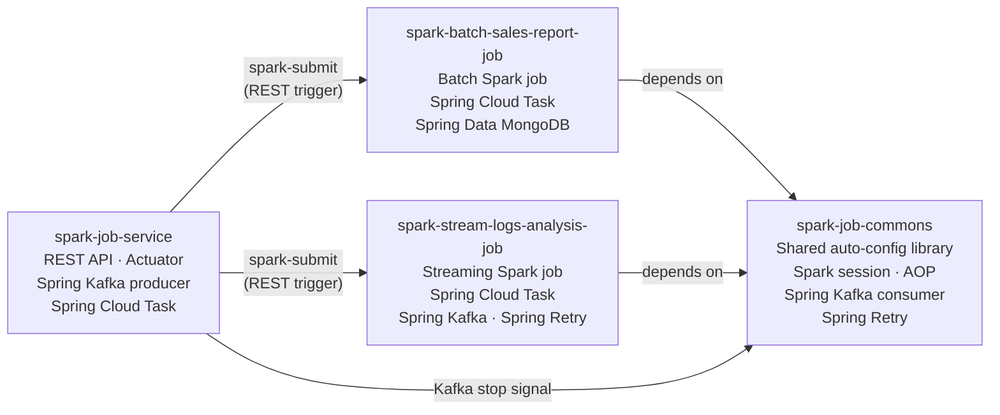
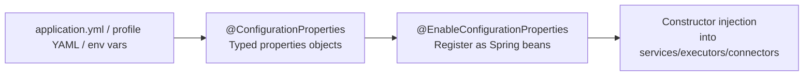
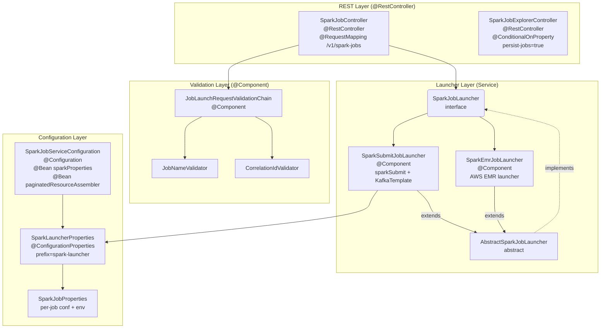
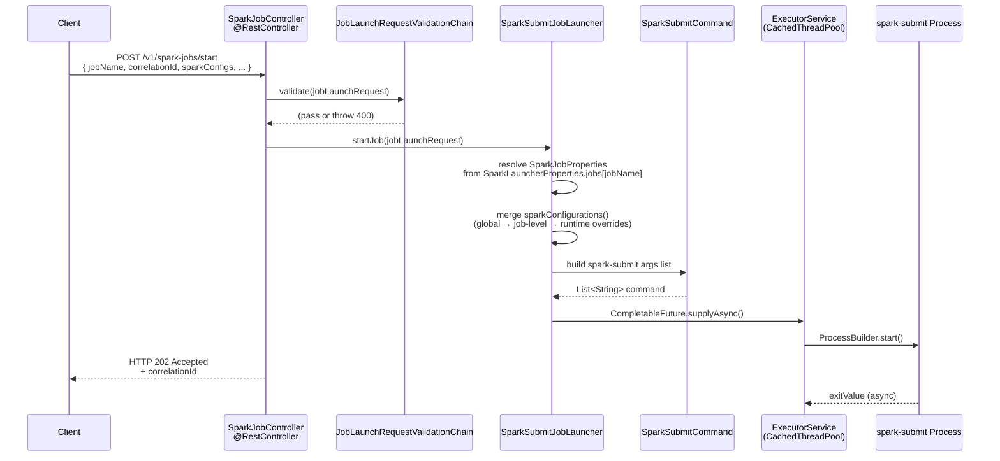
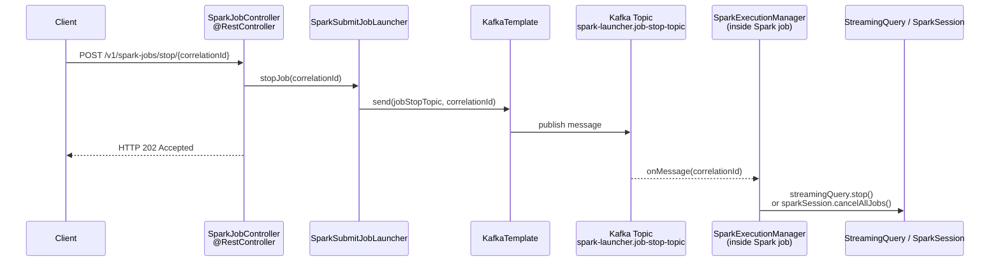
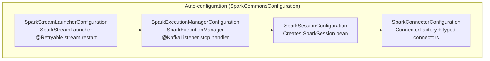
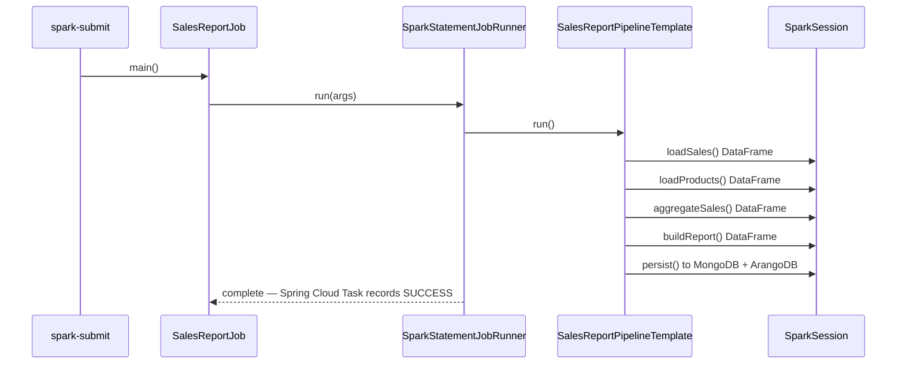
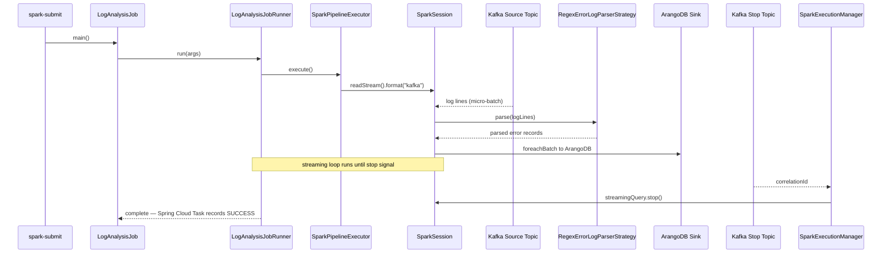

# Spring Boot Framework

This document describes the high-level frameworks and Spring Boot capabilities used by each of the four modules in this project. All modules share a common Spring Boot 3.4.0 parent and Apache Spark 4.0.0 (Scala 2.13).

---

## Module Overview

---

## Framework Summary by Module

| Framework / Library | spark-job-service | spark-job-commons | spark-batch-sales-report-job | spark-stream-logs-analysis-job |
|---|:---:|:---:|:---:|:---:|
| Spring Boot 3.4.0 | ✓ | ✓ | ✓ | ✓ |
| Spring Boot Web (Tomcat) | ✓ | | | |
| Spring Boot Actuator | ✓ | | | |
| Spring Boot Validation (JSR-303) | ✓ | | ✓ | ✓ |
| Spring Boot HATEOAS | ✓ | | | |
| Spring Boot Log4j2 | | ✓ | ✓ | ✓ |
| Spring Boot AOP | | ✓ | | |
| Spring Cloud Task 3.x | ✓ | ✓ | ✓ | ✓ |
| Spring Kafka | ✓ (producer) | ✓ (consumer) | | ✓ (consumer) |
| Spring Retry | | ✓ | | ✓ |
| Spring Data MongoDB | | | ✓ | |
| Springdoc OpenAPI 2.7.0 | ✓ | | | |
| Apache Spark Core + SQL 4.0 | | ✓ (provided) | ✓ (provided) | ✓ (provided) |
| Spark SQL–Kafka Connector | | ✓ | | ✓ |
| MongoDB Spark Connector | | ✓ | ✓ | |
| ArangoDB Spark Datasource | | ✓ | ✓ | ✓ |
| PostgreSQL JDBC | ✓ | ✓ | ✓ | ✓ |
| Lombok | ✓ | ✓ | ✓ | ✓ |
| maven-shade-plugin (uber JAR) | | | ✓ | ✓ |

---

## Common Configuration Binding Mechanism

All modules follow the same Spring Boot configuration pattern:
- Define typed configuration classes with `@ConfigurationProperties`.
- Register them with `@EnableConfigurationProperties` in module configuration.
- Inject them into runtime components using constructor injection.

Primary examples:
- [spark-job-service/src/main/java/com/aiks/spark/conf/SparkLauncherProperties.java](../spark-job-service/src/main/java/com/aiks/spark/conf/SparkLauncherProperties.java)
- [spark-job-service/src/main/java/com/aiks/spark/conf/SparkJobServiceConfiguration.java](../spark-job-service/src/main/java/com/aiks/spark/conf/SparkJobServiceConfiguration.java)
- [spark-job-service/src/main/java/com/aiks/spark/launcher/SparkSubmitJobLauncher.java](../spark-job-service/src/main/java/com/aiks/spark/launcher/SparkSubmitJobLauncher.java)
- [spark-job-commons/src/main/java/com/aiks/spark/common/config/properties/ConnectorProperties.java](../spark-job-commons/src/main/java/com/aiks/spark/common/config/properties/ConnectorProperties.java)
- [spark-job-commons/src/main/java/com/aiks/spark/common/config/SparkConnectorConfiguration.java](../spark-job-commons/src/main/java/com/aiks/spark/common/config/SparkConnectorConfiguration.java)
- [spark-batch-sales-report-job/src/main/java/com/aiks/spark/sales/conf/JobProperties.java](../spark-batch-sales-report-job/src/main/java/com/aiks/spark/sales/conf/JobProperties.java)
- [spark-batch-sales-report-job/src/main/java/com/aiks/spark/sales/conf/JobConfiguration.java](../spark-batch-sales-report-job/src/main/java/com/aiks/spark/sales/conf/JobConfiguration.java)
- [spark-stream-logs-analysis-job/src/main/java/com/aiks/spark/loganalysis/conf/JobProperties.java](../spark-stream-logs-analysis-job/src/main/java/com/aiks/spark/loganalysis/conf/JobProperties.java)
- [spark-stream-logs-analysis-job/src/main/java/com/aiks/spark/loganalysis/conf/JobConfiguration.java](../spark-stream-logs-analysis-job/src/main/java/com/aiks/spark/loganalysis/conf/JobConfiguration.java)

This mechanism is intentionally consistent across modules to make configuration behavior predictable during local runs, Docker, and Kubernetes deployments.

### Troubleshooting Configuration Binding

Common symptoms and checks:
- Symptom: App fails at startup with property validation errors.
    Check: `@Validated` constraints in properties classes and required YAML keys for the active profile.
- Symptom: Properties bean exists but values are null/default.
    Check: `@EnableConfigurationProperties(...)` is present in module config and prefix names exactly match YAML keys.
- Symptom: Profile-specific values are not applied.
    Check: active profile (`spring.profiles.active`) and file naming (`application-<profile>.yml`).
- Symptom: Environment variable overrides do not take effect.
    Check: variable naming/format and whether the process runtime actually received those env vars.
- Symptom: Runtime bean still uses old values.
    Check: constructor injection target type is the expected properties class and no duplicate bean wiring path is used.

---

## spark-job-service

A Spring Boot web service that accepts REST requests to start and stop Spark jobs by invoking `spark-submit` as an external process. It does not run Spark itself — it is a thin orchestration layer.

**Key frameworks:**
- **Spring Boot Web** — exposes `POST /v1/spark-jobs/start` and `POST /v1/spark-jobs/stop/{correlationId}` via `@RestController`
- **Spring Boot Actuator** — health and metrics endpoint at `/actuator/health`
- **Spring Boot Validation** — JSR-303 bean validation on `JobLaunchRequest` request bodies
- **Spring Boot HATEOAS** — paginated response assembly for execution history endpoints
- **Spring Cloud Task** — tracks job lifecycle (start, completion, failure) via `TaskExplorer` / `TaskRepository` backed by PostgreSQL
- **Spring Kafka** — `KafkaTemplate` publishes a stop signal (correlationId) to a Kafka topic when a stop request is received
- **Springdoc OpenAPI 2.7.0** — auto-generates Swagger UI from `@Tag`, `@Operation`, `@ApiResponses` annotations
- **spring-boot-problem-handler** — standardized RFC 7807 error responses
- **`@ConfigurationProperties`** — type-safe binding of all `spark-launcher.*` YAML properties to `SparkLauncherProperties` / `SparkJobProperties`

### Spring Boot Architecture Layers

The service is structured into four horizontal layers. Each layer has a single responsibility and communicates only with the layer immediately below it.

| Layer | Responsibility | Key Classes |
|---|---|---|
| **REST (Presentation)** | Expose HTTP endpoints, bind and validate request bodies, return `ResponseEntity` | `SparkJobController`, `SparkJobExplorerController` |
| **Validation** | Apply pre-launch rules via a chain of validators before the request reaches the launcher | `JobLaunchRequestValidationChain`, `JobNameValidator`, `CorrelationIdValidator` |
| **Launcher (Service)** | Build the `spark-submit` command, execute it asynchronously, publish stop signals to Kafka | `SparkJobLauncher` (interface), `AbstractSparkJobLauncher`, `SparkSubmitJobLauncher`, `SparkEmrJobLauncher` |
| **Configuration** | Bind `application.yml` properties to typed beans, produce shared infrastructure beans | `SparkJobServiceConfiguration`, `SparkLauncherProperties`, `SparkJobProperties` |

---

### Spring Boot Flow Architecture

The diagrams below trace the two primary HTTP flows end-to-end: submitting a job and stopping one.

#### Start Job Flow — `POST /v1/spark-jobs/start`

An HTTP request body is deserialised into a `JobLaunchRequest`, validated, then handed to `SparkSubmitJobLauncher` which builds and runs a `spark-submit` process asynchronously via a cached thread pool. The response is returned immediately as HTTP 202 Accepted while the job runs in the background.

#### Stop Job Flow — `POST /v1/spark-jobs/stop/{correlationId}`

Stopping a job is signal-based. The service publishes the `correlationId` to a Kafka topic. Inside the running Spark job, `SparkExecutionManager` consumes that topic and tears down the streaming query or cancels the Spark context.

---

### Key Spring Boot Annotations in Use

| Annotation | Location | Purpose |
|---|---|---|
| `@RestController` + `@RequestMapping` | `SparkJobController`, `SparkJobExplorerController` | Declare HTTP endpoints; return `ResponseEntity` automatically serialised to JSON |
| `@RequiredArgsConstructor` (Lombok) | Controllers, validators, launchers | Generate constructor injection without boilerplate |
| `@ConfigurationProperties(prefix=…)` | `SparkLauncherProperties` | Bind all `spark-launcher.*` YAML keys to a validated typed POJO |
| `@Validated` | `SparkLauncherProperties`, `SparkJobProperties` | Enforce JSR-303 constraints (`@NotEmpty`, `@NotNull`) on config at startup |
| `@Configuration` + `@Bean` | `SparkJobServiceConfiguration` | Produce shared beans (e.g., `sparkProperties`, `paginatedResourceAssembler`) |
| `@ConditionalOnProperty` | `SparkJobExplorerController` | Activate the execution-history controller only when `persist-jobs=true` |
| `@PreDestroy` | `SparkSubmitJobLauncher` | Shutdown the cached thread pool cleanly on application stop |
| `@Tag`, `@Operation`, `@ApiResponses` | Both controllers | Auto-generate OpenAPI 3 documentation via Springdoc |
| `@Component` | `JobLaunchRequestValidationChain`, validators | Register as Spring-managed beans; list auto-collected by Spring for the chain |

---

## spark-job-commons

A shared Spring Boot auto-configuration library consumed by both Spark job modules. It provides Spark session management, connector abstractions, execution lifecycle hooks, and the Kafka consumer that handles job stop signals.

**Key frameworks:**
- **Spring Boot Auto-configuration** — `SparkCommonsConfiguration` is registered as an auto-configuration class; consumers receive `SparkSession`, connectors, and execution management beans without explicit wiring
- **Spring Boot AOP (`spring-boot-starter-aop`)** — aspect-oriented hooks for cross-cutting concerns such as execution logging and retry advice
- **Spring Cloud Task** — `SpringCloudTaskConfiguration` integrates task lifecycle; `SparkExecutionManager` implements `TaskExecutionListener` to react to job start, completion, and failure events
- **Spring Kafka** — `@KafkaListener` in `SparkExecutionManager` subscribes to the stop topic; on receiving the correlationId it stops the active `StreamingQuery` or cancels all Spark jobs
- **Spring Retry** — `@Retryable` applied to stream restart logic in `SparkStreamLauncher`; retries on `StreamRetryableException` with configurable back-off
- **`@ConfigurationProperties`** — `ConnectorProperties` and its nested option classes (`JdbcOptions`, `MongoOptions`, `ArangoOptions`, `KafkaOptions`, `FileOptions`) bind connector config from YAML
- **`@ConditionalOnProperty` / `@ConditionalOnClass`** — sub-configurations (`SparkExecutionManagerConfiguration`, `SparkStreamLauncherConfiguration`) activate only when the required beans and properties are present

---

## spark-batch-sales-report-job

A Spring Boot application packaged as a `spark-submit`-compatible uber JAR (via maven-shade-plugin). It reads sales and product data, aggregates them with Spark SQL, and writes a report to MongoDB and ArangoDB.

**Key frameworks:**
- **Spring Boot (no web layer)** — started via `spring-cloud-starter-task`; no embedded HTTP server; the application exits after the job completes
- **Spring Cloud Task** — registers the run as a task execution; updates status in PostgreSQL via `TaskRepository`; an `ApplicationRunner` bean drives the pipeline
- **Spring Boot Validation** — `@ConfigurationProperties` with `@Validated` on `JobProperties` ensures all parameters are present at startup
- **Spring Boot Log4j2** — replaces default Logback; Log4j2 configuration in `log4j2.properties`
- **Spring Data MongoDB** — `MongoTemplate` used to seed and persist data during the `DataPopulator` pre-processing step
- **Apache Spark Core + SQL** (provided by Spark runtime) — `SparkSession`, Dataset/DataFrame APIs for batch transformations
- **MongoDB Spark Connector** — Spark DataFrameReader/Writer format `mongodb` for bulk reads and writes
- **ArangoDB Spark Datasource** — Spark DataFrameWriter format `arangodb` for persisting the final report
- **maven-shade-plugin** — produces a fat JAR with all dependencies (except Spark provided scope) for `spark-submit`

---

## spark-stream-logs-analysis-job

A Spring Boot application packaged as a `spark-submit`-compatible uber JAR. It runs a Spark Structured Streaming query that reads log lines from Kafka, parses error patterns with a regex strategy, and writes results to ArangoDB in micro-batch mode. It runs continuously until a stop signal is received via Kafka.

**Key frameworks:**
- **Spring Boot (no web layer)** — started via `spring-cloud-starter-task`; no embedded HTTP server
- **Spring Cloud Task** — task lifecycle management identical to the batch job; status persisted to PostgreSQL
- **Spring Boot Validation** — `@Validated` on `JobProperties` for startup-time config validation
- **Spring Boot Log4j2** — asynchronous appenders for high-throughput logging during streaming
- **Spring Kafka** — `KafkaTemplate` in `LogsGenerator` publishes sample log events to the input topic; `@KafkaListener` in `SparkExecutionManager` (from commons) handles stop signals
- **Spring Retry** — `@Retryable` in `SparkStreamLauncher` (from commons) restarts the streaming query on transient `StreamRetryableException`
- **Apache Spark Core + SQL** (provided) — `SparkSession` in local or cluster mode
- **Spark SQL–Kafka Connector** — provides a Kafka source (`readStream().format("kafka")`) for Structured Streaming
- **ArangoDB Spark Datasource** — micro-batch `foreachBatch` sink writes parsed error records to ArangoDB
- **maven-shade-plugin** — uber JAR for `spark-submit`

