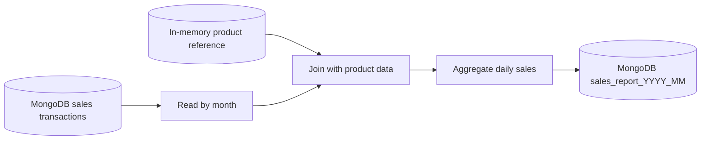

# Sales Report Job

Batch Spark job that generates monthly sales reports by combining:
- Sales transactions from MongoDB.
- Product reference data from an in-memory lookup dataset.

Main class: [SalesReportJob](src/main/java/com/ksoot/spark/sales/SalesReportJob.java)

## Installation

For prerequisites and infrastructure setup, see [Installation](../README.md#installation).

## Makefile Usage

From repository root:

```bash
make mk-image-batch
make mk-submit-sales SALES_MONTH=2024-11
make mk-show-recent-pods
```

For end-to-end verification, run:

```bash
make mk-smoke
```

## Pipeline Summary

Implementation entry point: [SparkPipelineExecutor](src/main/java/com/ksoot/spark/sales/SparkPipelineExecutor.java)

Flow:
1. Read sales data from MongoDB.
2. Filter records by the target month.
3. Join with in-memory product reference data.
4. Aggregate daily sales.
5. Write the result back to MongoDB as `sales_report_YYYY_MM`.

Sample data bootstrap: [DataPopulator](src/main/java/com/ksoot/spark/sales/DataPopulator.java)

## Dataflow Diagram



## Configuration

Primary file: [application.yml](src/main/resources/config/application.yml)

Frequently used properties:
- `ksoot.job.month` (env: `STATEMENT_MONTH`): report month in `YYYY-MM`.
- `ksoot.job.correlation-id` (env: `CORRELATION_ID`): execution tracking id.
- `ksoot.job.persist` (env: `PERSIST_JOB`): enable Spring Cloud Task persistence.
- `ksoot.connector.mongo-options.*`: MongoDB connection.

Connector configuration details are documented in [Connectors](../spark-job-commons/README.md#connectors).

Local overrides: [application-local.yml](src/main/resources/config/application-local.yml)

## Running Locally

### IntelliJ

Run [SalesReportJob](src/main/java/com/ksoot/spark/sales/SalesReportJob.java) with VM options:

```text
-Dspring.profiles.active=local
--add-exports java.base/sun.nio.ch=ALL-UNNAMED
```

Also enable IntelliJ option to include `provided` dependencies on classpath.

### Maven

```bash
mvn spring-boot:run -Dspring-boot.run.profiles=local
```

## Running via Job Service

This job can be launched through [Spark Job Service](../spark-job-service/README.md#running-locally).

Example:

```bash
curl -X POST 'http://localhost:8090/v1/spark-jobs/start' \
  -H 'Content-Type: application/json' \
  -d '{
    "jobName": "sales-report-job",
    "jobArguments": {
      "month": "2024-11"
    }
  }'
```

Stop request API reference: [Stop Spark Job](../spark-job-service/README.md#stop-spark-job)

## Minikube

For cluster prerequisites, see [Minikube](../README.md#minikube).

Recommended path is launching through `spark-job-service` with the `minikube` profile. This keeps runtime behavior aligned with the service-based deployment model used in this repository.

## Build and Test

Build jar:

```bash
mvn clean install
```

Build module image:

```bash
docker image build . -t spark-batch-sales-report-job:0.0.1 -f Dockerfile
```

Run tests:

```bash
mvn test
```

## References

- Apache Spark 4.0 docs: https://spark.apache.org/docs/4.0.0
- Spark configuration: https://spark.apache.org/docs/4.0.0/configuration.html
- Spring Cloud Task: https://spring.io/projects/spring-cloud-task
- MongoDB Spark connector: https://www.mongodb.com/docs/spark-connector/v10.4
- ArangoDB Spark datasource: https://docs.arangodb.com/3.13/develop/integrations/arangodb-datasource-for-apache-spark

