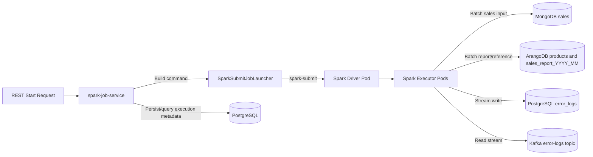

# Spark Job Service

Spring Boot service that accepts REST requests and launches Spark jobs using `spark-submit`.

## Installation

For prerequisites and repository-level setup, see [Installation](../README.md#installation).

## Dockerfile Introduction

The module Dockerfile is production-oriented and validated for this repository workflow.

- Base image: `aiks/spark:4.0.0`
- Artifact copied: `target/spark-job-service-*.jar` to `/app.jar`
- Runtime helper copied: `cmd/spark-job-submit.sh` to `$SPARK_HOME/bin`
- Container user: runs as non-root `spark` after setup
- Exposed port: `8090`
- Entrypoint: `java -jar /app.jar`

## Makefile Usage

From repository root, the most relevant operational targets for this module are:

```bash
make mk-image-job-service
make mk-deploy-app
make mk-rollout-status
make mk-port-forward
make mk-port-forward-postgres
make mk-port-forward-kafka-ui
make mk-port-forward-spark-ui
make mk-api-check
```

If local port-forward is unstable, use in-cluster submission helpers:

```bash
make mk-submit-sales
make mk-submit-logs
```

## What This Module Does

- Exposes job launcher APIs under `/v1/spark-jobs`.
- Exposes job execution query APIs under `/v1/spark-jobs/executions`.
- Supports multiple job request DTOs:
  - [SalesReportJobLaunchRequest](src/main/java/com/aiks/spark/dto/SalesReportJobLaunchRequest.java)
  - [LogsAnalysisJobLaunchRequest](src/main/java/com/aiks/spark/dto/LogsAnalysisJobLaunchRequest.java)
  - [SparkExampleJobLaunchRequest](src/main/java/com/aiks/spark/dto/SparkExampleJobLaunchRequest.java)
- Uses [SparkSubmitJobLauncher](src/main/java/com/aiks/spark/launcher/SparkSubmitJobLauncher.java) to build and execute `spark-submit` commands.

## Framework and Pattern References

For centralized details, see:

- [Spring Boot Framework](../docs/SPRING_BOOT_FRAMEWORK.md) for service-layer framework architecture and request flow.
- [Design Patterns](../docs/DESIGN_PATTERNS.md) for the Chain of Responsibility class diagram used by this module.

## Dataflow Diagram



## Configuration

Primary config files:

- [application.yml](src/main/resources/config/application.yml)
- [application-local.yml](src/main/resources/config/application-local.yml)
- [application-minikube.yml](src/main/resources/config/application-minikube.yml)

Key properties:

- `spark.*`: common Spark runtime settings.
- `spark-launcher.persist-jobs`: enables/disables execution history APIs.
- `spark-launcher.capture-jobs-logs`: streams child job logs into this service logs.
- `spark-launcher.jobs.*`: per-job launcher settings (`main-class-name`, `jar-file`, job-specific env/spark config).

The default HTTP port is `8090`.

## Running Locally

Ensure launcher scripts are executable:

```bash
chmod -R +x cmd/*
```

### Local Profile

1. Start infrastructure as documented in [Docker Compose](../README.md#docker-compose).
2. Build artifacts so referenced jars exist in local Maven repository.
3. Run with local profile:

```bash
mvn spring-boot:run -Dspring-boot.run.profiles=local
```

You can also run [SparkJobService.java](src/main/java/com/aiks/spark/SparkJobService.java) from IDE.

### Docker Compose App Profile

Use this path when you want `spark-job-service` itself to run in a Docker container on the same Compose network as Kafka, MongoDB, ArangoDB, and PostgreSQL.

```bash
make dc-up
make dc-up-app
```

This packages the service and Spark job jars, builds the `spark-job-service` image, and starts the container with the `docker` Spring profile. The container still launches child Spark jobs in local mode, while those jobs connect to Compose services using container hostnames (`mongo`, `arango`, `kafka`, `postgres-spark`).

Useful follow-up commands:

```bash
make dc-logs-app
make dc-stop-app
```

### Minikube Profile

1. Prepare Minikube infra as documented in [Preparing for Minikube](../README.md#preparing-for-minikube).
2. Update `spark.master` in [application-minikube.yml](src/main/resources/config/application-minikube.yml) using current `kubectl cluster-info` endpoint.
3. Run with minikube profile:

```bash
mvn spring-boot:run -Dspring-boot.run.profiles=minikube
```

Swagger UI:

- [http://localhost:8090/swagger-ui/index.html?urls.primaryName=Spark+Jobs](http://localhost:8090/swagger-ui/index.html?urls.primaryName=Spark+Jobs)

## API Reference

For a detailed endpoint reference with full examples, see [Spark Job Service API Documentation](../docs/SPARK_JOB_SERVICE_API.md).

Quick summary:

- Start endpoint: `POST /v1/spark-jobs/start`
- Stop endpoint: `POST /v1/spark-jobs/stop/{correlationId}`
- Execution endpoints are enabled when `spark-launcher.persist-jobs=true`

## Build

```bash
mvn clean install
```

## Testing

```bash
mvn test
```

## References

- Apache Spark 4.0 docs: [https://spark.apache.org/docs/4.0.0](https://spark.apache.org/docs/4.0.0)
- Running Spark on Kubernetes: [https://spark.apache.org/docs/4.0.0/running-on-kubernetes.html](https://spark.apache.org/docs/4.0.0/running-on-kubernetes.html)
- Spark submit: [https://spark.apache.org/docs/4.0.0/submitting-applications.html](https://spark.apache.org/docs/4.0.0/submitting-applications.html)
- Spring Boot: [https://docs.spring.io/spring-boot/index.html](https://docs.spring.io/spring-boot/index.html)
