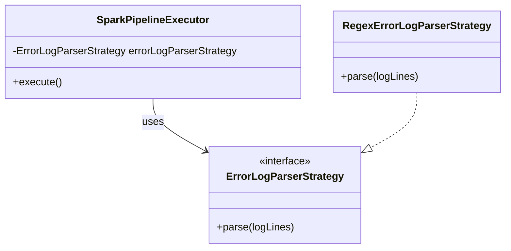
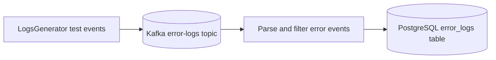

# Logs Analysis Job

Streaming Spark job that reads application logs from Kafka and writes parsed error records into PostgreSQL.

Main class: [LogAnalysisJob](src/main/java/com/ksoot/spark/loganalysis/LogAnalysisJob.java)

## Installation

For prerequisites and infrastructure setup, see [Installation](../README.md#installation).

## Dockerfile Introduction

The module Dockerfile is minimal and validated for Spark-on-Kubernetes execution in this project.

- Base image: `ksoot/spark:4.0.0`
- Artifact copied: `target/spark-stream-logs-analysis-job-*.jar` to `$SPARK_JOB_APPS_DIR/spark-stream-logs-analysis-job.jar`
- Entrypoint: `/opt/entrypoint.sh` (provided by the base image)

This image is intended to be launched by `spark-submit` through `spark-job-service`, not as a standalone HTTP service.

## Makefile Usage

From repository root:

```bash
make mk-image-stream
make mk-submit-logs
make mk-show-recent-pods
```

For end-to-end verification, run:

```bash
make mk-smoke
```

## Pipeline Summary

Implementation entry point: [SparkPipelineExecutor](src/main/java/com/ksoot/spark/loganalysis/SparkPipelineExecutor.java)

Flow:
1. Generate sample log events to Kafka via [LogsGenerator](src/main/java/com/ksoot/spark/loganalysis/LogsGenerator.java) (for local test data).
2. Read stream from Kafka topic `error-logs`.
3. Parse and filter error events.
4. Write results to PostgreSQL table `error_logs` in database `error_logs_db`.

The stream launcher and retry behavior are provided by commons utilities.

## Design Pattern

This module uses the Strategy pattern for log parsing:
- Strategy interface: [ErrorLogParserStrategy](src/main/java/com/ksoot/spark/loganalysis/parser/ErrorLogParserStrategy.java)
- Default strategy: [RegexErrorLogParserStrategy](src/main/java/com/ksoot/spark/loganalysis/parser/RegexErrorLogParserStrategy.java)
- Used by pipeline: [SparkPipelineExecutor](src/main/java/com/ksoot/spark/loganalysis/SparkPipelineExecutor.java)

This allows parser logic to be swapped without changing stream orchestration.

### Class Diagram



## Dataflow Diagram



## Configuration

Primary file: [application.yml](src/main/resources/config/application.yml)

Frequently used properties:
- `ksoot.job.correlation-id` (env: `CORRELATION_ID`)
- `ksoot.job.persist` (env: `PERSIST_JOB`)
- `ksoot.connector.kafka-options.topic` (env: `KAFKA_ERROR_LOGS_TOPIC`)
- `ksoot.connector.jdbc-options.url` (env: `JDBC_URL`)
- `ksoot.connector.kafka-options.fail-on-data-loss` (env: `KAFKA_FAIL_ON_DATA_LOSS`)

Connector configuration details are documented in [Connectors](../spark-job-commons/README.md#connectors).

Local overrides: [application-local.yml](src/main/resources/config/application-local.yml)

## Running Locally

### IntelliJ

Run [LogAnalysisJob](src/main/java/com/ksoot/spark/loganalysis/LogAnalysisJob.java) with VM options:

```text
-Dspring.profiles.active=local
--add-exports java.base/sun.nio.ch=ALL-UNNAMED
```

Also enable IntelliJ option to include `provided` dependencies on classpath.

### Maven

```bash
mvn spring-boot:run -Dspring-boot.run.profiles=local
```

## Running via Job Service

This job can be launched through [Spark Job Service](../spark-job-service/README.md#running-locally).

Example:

```bash
curl -X POST 'http://localhost:8090/v1/spark-jobs/start' \
  -H 'Content-Type: application/json' \
  -d '{
    "jobName": "logs-analysis-job"
  }'
```

Stop request API reference: [Stop Spark Job](../spark-job-service/README.md#stop-spark-job)

## Minikube

For cluster prerequisites, see [Minikube](../README.md#minikube).

Recommended path is launching through `spark-job-service` with the `minikube` profile.

## Build and Test

Build jar:

```bash
mvn clean install
```

Build module image:

```bash
docker image build . -t spark-stream-logs-analysis-job:0.0.1 -f Dockerfile
```

Run tests:

```bash
mvn test
```

## References

- Apache Spark 4.0 docs: https://spark.apache.org/docs/4.0.0
- Spark configuration: https://spark.apache.org/docs/4.0.0/configuration.html
- Spark Structured Streaming + Kafka: https://spark.apache.org/docs/4.0.0/structured-streaming-kafka-integration.html
- Spring Cloud Task: https://spring.io/projects/spring-cloud-task
